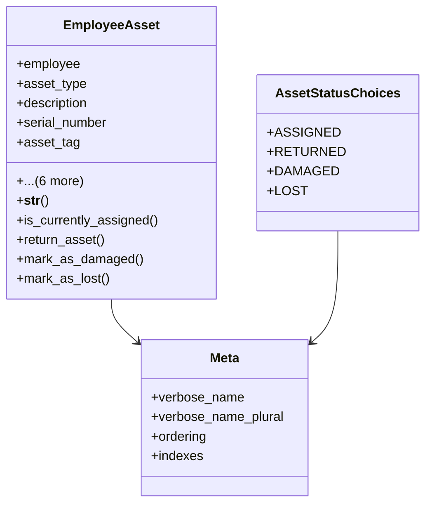

# services_modules.hr.models.employee_asset

## Imports
- django.db
- django.utils
- django.utils.translation

## Classes
- EmployeeAsset
  - attr: `employee`
  - attr: `asset_type`
  - attr: `description`
  - attr: `serial_number`
  - attr: `asset_tag`
  - attr: `assignment_date`
  - attr: `return_date`
  - attr: `status`
  - attr: `notes`
  - attr: `created_at`
  - attr: `updated_at`
  - method: `__str__`
  - method: `is_currently_assigned`
  - method: `return_asset`
  - method: `mark_as_damaged`
  - method: `mark_as_lost`
- AssetStatusChoices
  - attr: `ASSIGNED`
  - attr: `RETURNED`
  - attr: `DAMAGED`
  - attr: `LOST`
- Meta
  - attr: `verbose_name`
  - attr: `verbose_name_plural`
  - attr: `ordering`
  - attr: `indexes`

## Functions
- __str__
- is_currently_assigned
- return_asset
- mark_as_damaged
- mark_as_lost

## Class Diagram

