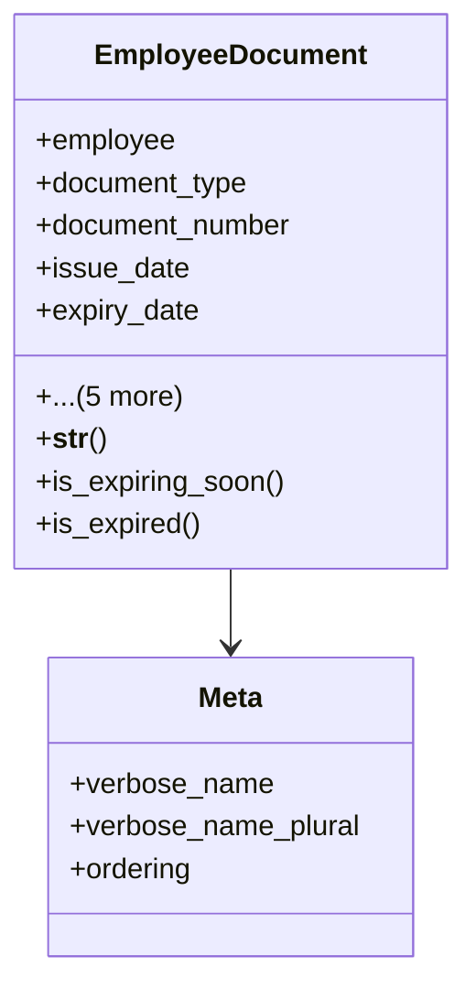

# services_modules.hr.models.employee_document

## Imports
- datetime
- django.db
- django.utils
- django.utils.translation

## Classes
- EmployeeDocument
  - attr: `employee`
  - attr: `document_type`
  - attr: `document_number`
  - attr: `issue_date`
  - attr: `expiry_date`
  - attr: `file`
  - attr: `notes`
  - attr: `notify_before_days`
  - attr: `created_at`
  - attr: `updated_at`
  - method: `__str__`
  - method: `is_expiring_soon`
  - method: `is_expired`
- Meta
  - attr: `verbose_name`
  - attr: `verbose_name_plural`
  - attr: `ordering`

## Functions
- __str__
- is_expiring_soon
- is_expired

## Class Diagram

