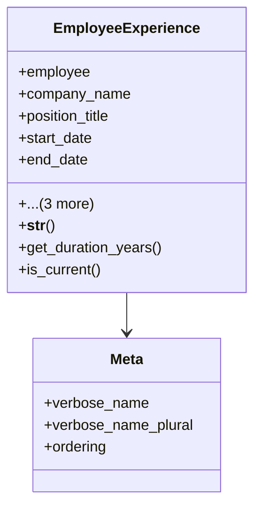

# services_modules.hr.models.employee_experience

## Imports
- datetime
- django.db
- django.utils
- django.utils.translation

## Classes
- EmployeeExperience
  - attr: `employee`
  - attr: `company_name`
  - attr: `position_title`
  - attr: `start_date`
  - attr: `end_date`
  - attr: `description`
  - attr: `created_at`
  - attr: `updated_at`
  - method: `__str__`
  - method: `get_duration_years`
  - method: `is_current`
- Meta
  - attr: `verbose_name`
  - attr: `verbose_name_plural`
  - attr: `ordering`

## Functions
- __str__
- get_duration_years
- is_current

## Class Diagram

