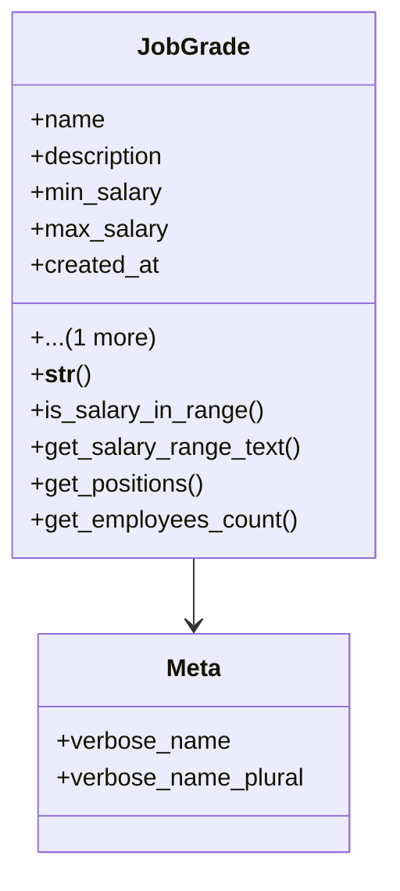

# services_modules.hr.models.job_grade

## Imports
- decimal
- django.db
- django.utils.translation
- employee
- position

## Classes
- JobGrade
  - attr: `name`
  - attr: `description`
  - attr: `min_salary`
  - attr: `max_salary`
  - attr: `created_at`
  - attr: `updated_at`
  - method: `__str__`
  - method: `is_salary_in_range`
  - method: `get_salary_range_text`
  - method: `get_positions`
  - method: `get_employees_count`
- Meta
  - attr: `verbose_name`
  - attr: `verbose_name_plural`

## Functions
- __str__
- is_salary_in_range
- get_salary_range_text
- get_positions
- get_employees_count

## Class Diagram

