# services_modules.hr.models

## Imports
- core_modules.organization.models
- datetime
- django.conf
- django.contrib.auth.models
- django.db
- django.utils
- django.utils.translation
- models.job_grade

## Classes
- Department
  - attr: `name_ar`
  - attr: `name_en`
  - attr: `company`
  - attr: `parent`
  - attr: `manager`
  - attr: `is_active`
  - attr: `created_at`
  - attr: `updated_at`
  - method: `__str__`
- Position
  - attr: `title_ar`
  - attr: `title_en`
  - attr: `department`
  - attr: `job_grade`
  - attr: `job_description`
  - attr: `required_qualifications`
  - attr: `required_experience`
  - attr: `reports_to`
  - attr: `is_active`
  - attr: `created_at`
  - attr: `updated_at`
  - method: `__str__`
- Employee
  - attr: `user`
  - attr: `employee_number`
  - attr: `first_name_ar`
  - attr: `last_name_ar`
  - attr: `first_name_en`
  - attr: `last_name_en`
  - attr: `gender`
  - attr: `date_of_birth`
  - attr: `nationality`
  - attr: `national_id`
  - attr: `marital_status`
  - attr: `photo`
  - attr: `personal_email`
  - attr: `mobile_phone`
  - attr: `work_email`
  - attr: `work_phone`
  - attr: `company_mobile`
  - attr: `address`
  - attr: `hire_date`
  - attr: `termination_date`
  - attr: `branch`
  - attr: `department`
  - attr: `position`
  - attr: `manager`
  - attr: `status`
  - attr: `emergency_contact_name`
  - attr: `emergency_contact_relation`
  - attr: `emergency_contact_phone`
  - attr: `bank_name`
  - attr: `bank_account_number`
  - attr: `bank_iban`
  - attr: `company_car_details`
  - attr: `created_at`
  - attr: `updated_at`
  - method: `__str__`
- EmployeeAsset
  - attr: `employee`
  - attr: `asset_type`
  - attr: `description`
  - attr: `serial_number`
  - attr: `asset_tag`
  - attr: `assignment_date`
  - attr: `return_date`
  - attr: `status`
  - attr: `notes`
  - attr: `created_at`
  - attr: `updated_at`
  - method: `__str__`
- EmployeeDocument
  - attr: `employee`
  - attr: `document_type`
  - attr: `document_number`
  - attr: `issue_date`
  - attr: `expiry_date`
  - attr: `file`
  - attr: `notes`
  - attr: `notify_before_days`
  - attr: `created_at`
  - attr: `updated_at`
  - method: `__str__`
- EmployeeExperience
  - attr: `employee`
  - attr: `company_name`
  - attr: `position_title`
  - attr: `start_date`
  - attr: `end_date`
  - attr: `description`
  - method: `__str__`
- EmployeeQualification
  - attr: `employee`
  - attr: `institution_name`
  - attr: `degree`
  - attr: `field_of_study`
  - attr: `start_date`
  - attr: `completion_date`
  - attr: `grade`
  - method: `__str__`
- EmployeeTraining
  - attr: `employee`
  - attr: `course_name`
  - attr: `provider`
  - attr: `completion_date`
  - attr: `duration_hours`
  - attr: `certificate_file`
  - method: `__str__`
- Contract
  - attr: `employee`
  - attr: `contract_type`
  - attr: `start_date`
  - attr: `end_date`
  - attr: `position`
  - attr: `salary`
  - attr: `salary_currency`
  - attr: `working_hours_per_week`
  - attr: `probation_period_months`
  - attr: `is_active`
  - attr: `contract_file`
  - attr: `created_at`
  - attr: `updated_at`
- PayrollPeriod
  - attr: `name`
  - attr: `start_date`
  - attr: `end_date`
  - attr: `is_closed`
  - method: `__str__`
- SalaryStructure
  - attr: `name`
  - attr: `description`
  - attr: `is_active`
  - method: `__str__`
- SalaryRuleCategory
  - attr: `name`
  - attr: `code`
  - method: `__str__`
- SalaryRule
  - attr: `name`
  - attr: `code`
  - attr: `category`
  - attr: `structure`
  - attr: `sequence`
  - attr: `is_active`
  - attr: `appears_on_payslip`
  - attr: `condition_select`
  - attr: `condition_range_min`
  - attr: `condition_range_max`
  - attr: `condition_python_code`
  - attr: `amount_select`
  - attr: `amount_fixed`
  - attr: `amount_percentage_base`
  - attr: `amount_percentage`
  - attr: `amount_python_code`
  - method: `__str__`
- Payslip
  - attr: `employee`
  - attr: `period`
  - attr: `contract`
  - attr: `structure`
  - attr: `name`
  - attr: `status`
  - attr: `date_from`
  - attr: `date_to`
  - attr: `net_pay`
  - attr: `notes`
  - attr: `created_at`
  - attr: `updated_at`
  - method: `save`
  - method: `__str__`
- PayslipLine
  - attr: `payslip`
  - attr: `salary_rule`
  - attr: `name`
  - attr: `code`
  - attr: `category`
  - attr: `sequence`
  - attr: `quantity`
  - attr: `amount`
  - attr: `total`
  - method: `__str__`
- Meta
  - attr: `verbose_name`
  - attr: `verbose_name_plural`
  - attr: `unique_together`
- Meta
  - attr: `verbose_name`
  - attr: `verbose_name_plural`
  - attr: `unique_together`
- GenderChoices
  - attr: `MALE`
  - attr: `FEMALE`
- MaritalStatusChoices
  - attr: `SINGLE`
  - attr: `MARRIED`
  - attr: `DIVORCED`
  - attr: `WIDOWED`
- EmployeeStatusChoices
  - attr: `ACTIVE`
  - attr: `INACTIVE`
  - attr: `SUSPENDED`
  - attr: `TERMINATED`
  - attr: `PENDING_HIRE`
  - attr: `BLACKLISTED`
  - attr: `ON_LEAVE`
- Meta
  - attr: `verbose_name`
  - attr: `verbose_name_plural`
  - attr: `ordering`
- AssetStatusChoices
  - attr: `ASSIGNED`
  - attr: `RETURNED`
  - attr: `DAMAGED`
  - attr: `LOST`
- Meta
  - attr: `verbose_name`
  - attr: `verbose_name_plural`
  - attr: `ordering`
- Meta
  - attr: `verbose_name`
  - attr: `verbose_name_plural`
  - attr: `ordering`
- Meta
  - attr: `verbose_name`
  - attr: `verbose_name_plural`
  - attr: `ordering`
- Meta
  - attr: `verbose_name`
  - attr: `verbose_name_plural`
  - attr: `ordering`
- Meta
  - attr: `verbose_name`
  - attr: `verbose_name_plural`
  - attr: `ordering`
- ContractTypeChoices
  - attr: `FULL_TIME`
  - attr: `PART_TIME`
  - attr: `FIXED_TERM`
  - attr: `INTERNSHIP`
  - attr: `DAILY_WAGE`
  - attr: `PROJECT_BASED`
- Meta
  - attr: `verbose_name`
  - attr: `verbose_name_plural`
  - attr: `ordering`
- Meta
  - attr: `verbose_name`
  - attr: `verbose_name_plural`
  - attr: `ordering`
- Meta
  - attr: `verbose_name`
  - attr: `verbose_name_plural`
- Meta
  - attr: `verbose_name`
  - attr: `verbose_name_plural`
- ConditionSelect
  - attr: `ALWAYS`
  - attr: `RANGE`
  - attr: `PYTHON`
- AmountSelect
  - attr: `FIXED`
  - attr: `PERCENTAGE`
  - attr: `PYTHON`
- Meta
  - attr: `verbose_name`
  - attr: `verbose_name_plural`
  - attr: `ordering`
- PayslipStatus
  - attr: `DRAFT`
  - attr: `CONFIRMED`
  - attr: `PAID`
  - attr: `CANCELLED`
- Meta
  - attr: `verbose_name`
  - attr: `verbose_name_plural`
  - attr: `unique_together`
  - attr: `ordering`
- Meta
  - attr: `verbose_name`
  - attr: `verbose_name_plural`
  - attr: `ordering`

## Functions
- __str__
- __str__
- __str__
- __str__
- __str__
- __str__
- __str__
- __str__
- __str__
- __str__
- __str__
- __str__
- save
- __str__
- __str__

## Module Variables
- `AUTH_USER_MODEL`
- `__all__`

## Class Diagram

```mermaid
classDiagram
    class Department {
        +name_ar
        +name_en
        +company
        +parent
        +manager
        +... (3 more)
        +__str__()
    }
    class Position {
        +title_ar
        +title_en
        +department
        +job_grade
        +job_description
        +... (6 more)
        +__str__()
    }
    class Employee {
        +user
        +employee_number
        +first_name_ar
        +last_name_ar
        +first_name_en
        +... (29 more)
        +__str__()
    }
    class EmployeeAsset {
        +employee
        +asset_type
        +description
        +serial_number
        +asset_tag
        +... (6 more)
        +__str__()
    }
    class EmployeeDocument {
        +employee
        +document_type
        +document_number
        +issue_date
        +expiry_date
        +... (5 more)
        +__str__()
    }
    class EmployeeExperience {
        +employee
        +company_name
        +position_title
        +start_date
        +end_date
        +... (1 more)
        +__str__()
    }
    class EmployeeQualification {
        +employee
        +institution_name
        +degree
        +field_of_study
        +start_date
        +... (2 more)
        +__str__()
    }
    class EmployeeTraining {
        +employee
        +course_name
        +provider
        +completion_date
        +duration_hours
        +... (1 more)
        +__str__()
    }
    class Contract {
        +employee
        +contract_type
        +start_date
        +end_date
        +position
        +... (8 more)
    }
    class PayrollPeriod {
        +name
        +start_date
        +end_date
        +is_closed
        +__str__()
    }
    class SalaryStructure {
        +name
        +description
        +is_active
        +__str__()
    }
    class SalaryRuleCategory {
        +name
        +code
        +__str__()
    }
    class SalaryRule {
        +name
        +code
        +category
        +structure
        +sequence
        +... (11 more)
        +__str__()
    }
    class Payslip {
        +employee
        +period
        +contract
        +structure
        +name
        +... (7 more)
        +save()
        +__str__()
    }
    class PayslipLine {
        +payslip
        +salary_rule
        +name
        +code
        +category
        +... (4 more)
        +__str__()
    }
    class Meta {
        +verbose_name
        +verbose_name_plural
        +unique_together
    }
    class Meta {
        +verbose_name
        +verbose_name_plural
        +unique_together
    }
    class GenderChoices {
        +MALE
        +FEMALE
    }
    class MaritalStatusChoices {
        +SINGLE
        +MARRIED
        +DIVORCED
        +WIDOWED
    }
    class EmployeeStatusChoices {
        +ACTIVE
        +INACTIVE
        +SUSPENDED
        +TERMINATED
        +PENDING_HIRE
        +... (2 more)
    }
    class Meta {
        +verbose_name
        +verbose_name_plural
        +ordering
    }
    class AssetStatusChoices {
        +ASSIGNED
        +RETURNED
        +DAMAGED
        +LOST
    }
    class Meta {
        +verbose_name
        +verbose_name_plural
        +ordering
    }
    class Meta {
        +verbose_name
        +verbose_name_plural
        +ordering
    }
    class Meta {
        +verbose_name
        +verbose_name_plural
        +ordering
    }
    class Meta {
        +verbose_name
        +verbose_name_plural
        +ordering
    }
    class Meta {
        +verbose_name
        +verbose_name_plural
        +ordering
    }
    class ContractTypeChoices {
        +FULL_TIME
        +PART_TIME
        +FIXED_TERM
        +INTERNSHIP
        +DAILY_WAGE
        +... (1 more)
    }
    class Meta {
        +verbose_name
        +verbose_name_plural
        +ordering
    }
    class Meta {
        +verbose_name
        +verbose_name_plural
        +ordering
    }
    class Meta {
        +verbose_name
        +verbose_name_plural
    }
    class Meta {
        +verbose_name
        +verbose_name_plural
    }
    class ConditionSelect {
        +ALWAYS
        +RANGE
        +PYTHON
    }
    class AmountSelect {
        +FIXED
        +PERCENTAGE
        +PYTHON
    }
    class Meta {
        +verbose_name
        +verbose_name_plural
        +ordering
    }
    class PayslipStatus {
        +DRAFT
        +CONFIRMED
        +PAID
        +CANCELLED
    }
    class Meta {
        +verbose_name
        +verbose_name_plural
        +unique_together
        +ordering
    }
    class Meta {
        +verbose_name
        +verbose_name_plural
        +ordering
    }
    Department --> Meta
    Department --> Meta
    Department --> Meta
    Department --> Meta
    Department --> Meta
    Department --> Meta
    Department --> Meta
    Department --> Meta
    Department --> Meta
    Department --> Meta
    Department --> Meta
    Department --> Meta
    Department --> Meta
    Department --> Meta
    Department --> Meta
    Position --> Meta
    Position --> Meta
    Position --> Meta
    Position --> Meta
    Position --> Meta
    Position --> Meta
    Position --> Meta
    Position --> Meta
    Position --> Meta
    Position --> Meta
    Position --> Meta
    Position --> Meta
    Position --> Meta
    Position --> Meta
    Position --> Meta
    Employee --> Meta
    Employee --> Meta
    Employee --> Meta
    Employee --> Meta
    Employee --> Meta
    Employee --> Meta
    Employee --> Meta
    Employee --> Meta
    Employee --> Meta
    Employee --> Meta
    Employee --> Meta
    Employee --> Meta
    Employee --> Meta
    Employee --> Meta
    Employee --> Meta
    EmployeeAsset --> Meta
    EmployeeAsset --> Meta
    EmployeeAsset --> Meta
    EmployeeAsset --> Meta
    EmployeeAsset --> Meta
    EmployeeAsset --> Meta
    EmployeeAsset --> Meta
    EmployeeAsset --> Meta
    EmployeeAsset --> Meta
    EmployeeAsset --> Meta
    EmployeeAsset --> Meta
    EmployeeAsset --> Meta
    EmployeeAsset --> Meta
    EmployeeAsset --> Meta
    EmployeeAsset --> Meta
    EmployeeDocument --> Meta
    EmployeeDocument --> Meta
    EmployeeDocument --> Meta
    EmployeeDocument --> Meta
    EmployeeDocument --> Meta
    EmployeeDocument --> Meta
    EmployeeDocument --> Meta
    EmployeeDocument --> Meta
    EmployeeDocument --> Meta
    EmployeeDocument --> Meta
    EmployeeDocument --> Meta
    EmployeeDocument --> Meta
    EmployeeDocument --> Meta
    EmployeeDocument --> Meta
    EmployeeDocument --> Meta
    EmployeeExperience --> Meta
    EmployeeExperience --> Meta
    EmployeeExperience --> Meta
    EmployeeExperience --> Meta
    EmployeeExperience --> Meta
    EmployeeExperience --> Meta
    EmployeeExperience --> Meta
    EmployeeExperience --> Meta
    EmployeeExperience --> Meta
    EmployeeExperience --> Meta
    EmployeeExperience --> Meta
    EmployeeExperience --> Meta
    EmployeeExperience --> Meta
    EmployeeExperience --> Meta
    EmployeeExperience --> Meta
    EmployeeQualification --> Meta
    EmployeeQualification --> Meta
    EmployeeQualification --> Meta
    EmployeeQualification --> Meta
    EmployeeQualification --> Meta
    EmployeeQualification --> Meta
    EmployeeQualification --> Meta
    EmployeeQualification --> Meta
    EmployeeQualification --> Meta
    EmployeeQualification --> Meta
    EmployeeQualification --> Meta
    EmployeeQualification --> Meta
    EmployeeQualification --> Meta
    EmployeeQualification --> Meta
    EmployeeQualification --> Meta
    EmployeeTraining --> Meta
    EmployeeTraining --> Meta
    EmployeeTraining --> Meta
    EmployeeTraining --> Meta
    EmployeeTraining --> Meta
    EmployeeTraining --> Meta
    EmployeeTraining --> Meta
    EmployeeTraining --> Meta
    EmployeeTraining --> Meta
    EmployeeTraining --> Meta
    EmployeeTraining --> Meta
    EmployeeTraining --> Meta
    EmployeeTraining --> Meta
    EmployeeTraining --> Meta
    EmployeeTraining --> Meta
    Contract --> Meta
    Contract --> Meta
    Contract --> Meta
    Contract --> Meta
    Contract --> Meta
    Contract --> Meta
    Contract --> Meta
    Contract --> Meta
    Contract --> Meta
    Contract --> Meta
    Contract --> Meta
    Contract --> Meta
    Contract --> Meta
    Contract --> Meta
    Contract --> Meta
    PayrollPeriod --> Meta
    PayrollPeriod --> Meta
    PayrollPeriod --> Meta
    PayrollPeriod --> Meta
    PayrollPeriod --> Meta
    PayrollPeriod --> Meta
    PayrollPeriod --> Meta
    PayrollPeriod --> Meta
    PayrollPeriod --> Meta
    PayrollPeriod --> Meta
    PayrollPeriod --> Meta
    PayrollPeriod --> Meta
    PayrollPeriod --> Meta
    PayrollPeriod --> Meta
    PayrollPeriod --> Meta
    SalaryStructure --> Meta
    SalaryStructure --> Meta
    SalaryStructure --> Meta
    SalaryStructure --> Meta
    SalaryStructure --> Meta
    SalaryStructure --> Meta
    SalaryStructure --> Meta
    SalaryStructure --> Meta
    SalaryStructure --> Meta
    SalaryStructure --> Meta
    SalaryStructure --> Meta
    SalaryStructure --> Meta
    SalaryStructure --> Meta
    SalaryStructure --> Meta
    SalaryStructure --> Meta
    SalaryRuleCategory --> Meta
    SalaryRuleCategory --> Meta
    SalaryRuleCategory --> Meta
    SalaryRuleCategory --> Meta
    SalaryRuleCategory --> Meta
    SalaryRuleCategory --> Meta
    SalaryRuleCategory --> Meta
    SalaryRuleCategory --> Meta
    SalaryRuleCategory --> Meta
    SalaryRuleCategory --> Meta
    SalaryRuleCategory --> Meta
    SalaryRuleCategory --> Meta
    SalaryRuleCategory --> Meta
    SalaryRuleCategory --> Meta
    SalaryRuleCategory --> Meta
    SalaryRule --> Meta
    SalaryRule --> Meta
    SalaryRule --> Meta
    SalaryRule --> Meta
    SalaryRule --> Meta
    SalaryRule --> Meta
    SalaryRule --> Meta
    SalaryRule --> Meta
    SalaryRule --> Meta
    SalaryRule --> Meta
    SalaryRule --> Meta
    SalaryRule --> Meta
    SalaryRule --> Meta
    SalaryRule --> Meta
    SalaryRule --> Meta
    Payslip --> Meta
    Payslip --> Meta
    Payslip --> Meta
    Payslip --> Meta
    Payslip --> Meta
    Payslip --> Meta
    Payslip --> Meta
    Payslip --> Meta
    Payslip --> Meta
    Payslip --> Meta
    Payslip --> Meta
    Payslip --> Meta
    Payslip --> Meta
    Payslip --> Meta
    Payslip --> Meta
    PayslipLine --> Meta
    PayslipLine --> Meta
    PayslipLine --> Meta
    PayslipLine --> Meta
    PayslipLine --> Meta
    PayslipLine --> Meta
    PayslipLine --> Meta
    PayslipLine --> Meta
    PayslipLine --> Meta
    PayslipLine --> Meta
    PayslipLine --> Meta
    PayslipLine --> Meta
    PayslipLine --> Meta
    PayslipLine --> Meta
    PayslipLine --> Meta
    GenderChoices --> Meta
    GenderChoices --> Meta
    GenderChoices --> Meta
    GenderChoices --> Meta
    GenderChoices --> Meta
    GenderChoices --> Meta
    GenderChoices --> Meta
    GenderChoices --> Meta
    GenderChoices --> Meta
    GenderChoices --> Meta
    GenderChoices --> Meta
    GenderChoices --> Meta
    GenderChoices --> Meta
    GenderChoices --> Meta
    GenderChoices --> Meta
    MaritalStatusChoices --> Meta
    MaritalStatusChoices --> Meta
    MaritalStatusChoices --> Meta
    MaritalStatusChoices --> Meta
    MaritalStatusChoices --> Meta
    MaritalStatusChoices --> Meta
    MaritalStatusChoices --> Meta
    MaritalStatusChoices --> Meta
    MaritalStatusChoices --> Meta
    MaritalStatusChoices --> Meta
    MaritalStatusChoices --> Meta
    MaritalStatusChoices --> Meta
    MaritalStatusChoices --> Meta
    MaritalStatusChoices --> Meta
    MaritalStatusChoices --> Meta
    EmployeeStatusChoices --> Meta
    EmployeeStatusChoices --> Meta
    EmployeeStatusChoices --> Meta
    EmployeeStatusChoices --> Meta
    EmployeeStatusChoices --> Meta
    EmployeeStatusChoices --> Meta
    EmployeeStatusChoices --> Meta
    EmployeeStatusChoices --> Meta
    EmployeeStatusChoices --> Meta
    EmployeeStatusChoices --> Meta
    EmployeeStatusChoices --> Meta
    EmployeeStatusChoices --> Meta
    EmployeeStatusChoices --> Meta
    EmployeeStatusChoices --> Meta
    EmployeeStatusChoices --> Meta
    AssetStatusChoices --> Meta
    AssetStatusChoices --> Meta
    AssetStatusChoices --> Meta
    AssetStatusChoices --> Meta
    AssetStatusChoices --> Meta
    AssetStatusChoices --> Meta
    AssetStatusChoices --> Meta
    AssetStatusChoices --> Meta
    AssetStatusChoices --> Meta
    AssetStatusChoices --> Meta
    AssetStatusChoices --> Meta
    AssetStatusChoices --> Meta
    AssetStatusChoices --> Meta
    AssetStatusChoices --> Meta
    AssetStatusChoices --> Meta
    ContractTypeChoices --> Meta
    ContractTypeChoices --> Meta
    ContractTypeChoices --> Meta
    ContractTypeChoices --> Meta
    ContractTypeChoices --> Meta
    ContractTypeChoices --> Meta
    ContractTypeChoices --> Meta
    ContractTypeChoices --> Meta
    ContractTypeChoices --> Meta
    ContractTypeChoices --> Meta
    ContractTypeChoices --> Meta
    ContractTypeChoices --> Meta
    ContractTypeChoices --> Meta
    ContractTypeChoices --> Meta
    ContractTypeChoices --> Meta
    ConditionSelect --> Meta
    ConditionSelect --> Meta
    ConditionSelect --> Meta
    ConditionSelect --> Meta
    ConditionSelect --> Meta
    ConditionSelect --> Meta
    ConditionSelect --> Meta
    ConditionSelect --> Meta
    ConditionSelect --> Meta
    ConditionSelect --> Meta
    ConditionSelect --> Meta
    ConditionSelect --> Meta
    ConditionSelect --> Meta
    ConditionSelect --> Meta
    ConditionSelect --> Meta
    AmountSelect --> Meta
    AmountSelect --> Meta
    AmountSelect --> Meta
    AmountSelect --> Meta
    AmountSelect --> Meta
    AmountSelect --> Meta
    AmountSelect --> Meta
    AmountSelect --> Meta
    AmountSelect --> Meta
    AmountSelect --> Meta
    AmountSelect --> Meta
    AmountSelect --> Meta
    AmountSelect --> Meta
    AmountSelect --> Meta
    AmountSelect --> Meta
    PayslipStatus --> Meta
    PayslipStatus --> Meta
    PayslipStatus --> Meta
    PayslipStatus --> Meta
    PayslipStatus --> Meta
    PayslipStatus --> Meta
    PayslipStatus --> Meta
    PayslipStatus --> Meta
    PayslipStatus --> Meta
    PayslipStatus --> Meta
    PayslipStatus --> Meta
    PayslipStatus --> Meta
    PayslipStatus --> Meta
    PayslipStatus --> Meta
    PayslipStatus --> Meta
```

