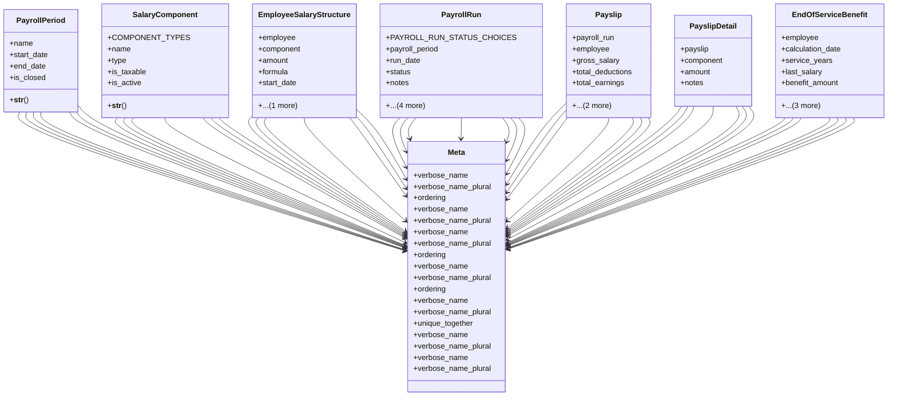

# services_modules.hr.payroll

## Imports
- django.conf
- django.db
- django.utils.translation
- employee

## Classes
- PayrollPeriod
  - attr: `name`
  - attr: `start_date`
  - attr: `end_date`
  - attr: `is_closed`
  - method: `__str__`
- SalaryComponent
  - attr: `COMPONENT_TYPES`
  - attr: `name`
  - attr: `type`
  - attr: `is_taxable`
  - attr: `is_active`
  - method: `__str__`
- EmployeeSalaryStructure
  - attr: `employee`
  - attr: `component`
  - attr: `amount`
  - attr: `formula`
  - attr: `start_date`
  - attr: `end_date`
- PayrollRun
  - attr: `PAYROLL_RUN_STATUS_CHOICES`
  - attr: `payroll_period`
  - attr: `run_date`
  - attr: `status`
  - attr: `notes`
  - attr: `created_by`
  - attr: `approved_by`
  - attr: `paid_by`
  - attr: `paid_at`
- Payslip
  - attr: `payroll_run`
  - attr: `employee`
  - attr: `gross_salary`
  - attr: `total_deductions`
  - attr: `total_earnings`
  - attr: `net_salary`
  - attr: `payment_method`
- PayslipDetail
  - attr: `payslip`
  - attr: `component`
  - attr: `amount`
  - attr: `notes`
- EndOfServiceBenefit
  - attr: `employee`
  - attr: `calculation_date`
  - attr: `service_years`
  - attr: `last_salary`
  - attr: `benefit_amount`
  - attr: `notes`
  - attr: `is_paid`
  - attr: `payment_date`
- Meta
  - attr: `verbose_name`
  - attr: `verbose_name_plural`
  - attr: `ordering`
- Meta
  - attr: `verbose_name`
  - attr: `verbose_name_plural`
- Meta
  - attr: `verbose_name`
  - attr: `verbose_name_plural`
  - attr: `ordering`
- Meta
  - attr: `verbose_name`
  - attr: `verbose_name_plural`
  - attr: `ordering`
- Meta
  - attr: `verbose_name`
  - attr: `verbose_name_plural`
  - attr: `unique_together`
- Meta
  - attr: `verbose_name`
  - attr: `verbose_name_plural`
- Meta
  - attr: `verbose_name`
  - attr: `verbose_name_plural`

## Functions
- __str__
- __str__

## Class Diagram

