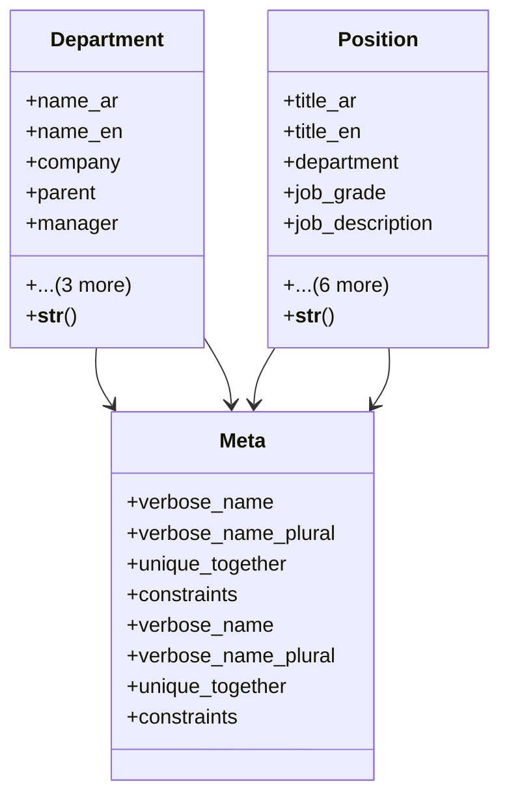

# services_modules.hr.structure

## Imports
- core_modules.organization.models
- django.conf
- django.db
- django.utils.translation

## Classes
- Department
  - attr: `name_ar`
  - attr: `name_en`
  - attr: `company`
  - attr: `parent`
  - attr: `manager`
  - attr: `is_active`
  - attr: `created_at`
  - attr: `updated_at`
  - method: `__str__`
- Position
  - attr: `title_ar`
  - attr: `title_en`
  - attr: `department`
  - attr: `job_grade`
  - attr: `job_description`
  - attr: `required_qualifications`
  - attr: `required_experience`
  - attr: `reports_to`
  - attr: `is_active`
  - attr: `created_at`
  - attr: `updated_at`
  - method: `__str__`
- Meta
  - attr: `verbose_name`
  - attr: `verbose_name_plural`
  - attr: `unique_together`
  - attr: `constraints`
- Meta
  - attr: `verbose_name`
  - attr: `verbose_name_plural`
  - attr: `unique_together`
  - attr: `constraints`

## Functions
- __str__
- __str__

## Module Variables
- `User`

## Class Diagram

