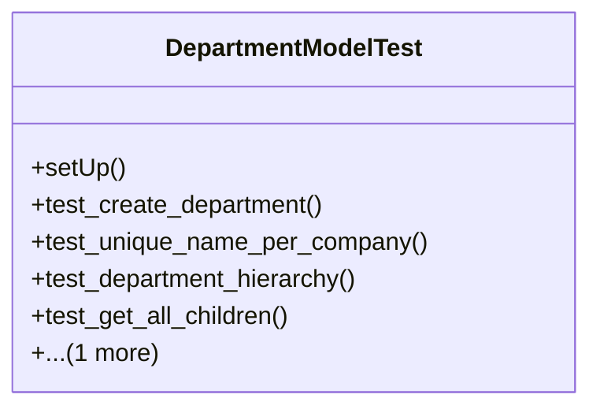

# services_modules.hr.tests.test_department

## Imports
- core_modules.companies.models
- django.db
- django.test
- models.department

## Classes
- DepartmentModelTest
  - method: `setUp`
  - method: `test_create_department`
  - method: `test_unique_name_per_company`
  - method: `test_department_hierarchy`
  - method: `test_get_all_children`
  - method: `test_get_hierarchy_level`

## Functions
- setUp
- test_create_department
- test_unique_name_per_company
- test_department_hierarchy
- test_get_all_children
- test_get_hierarchy_level

## Class Diagram

