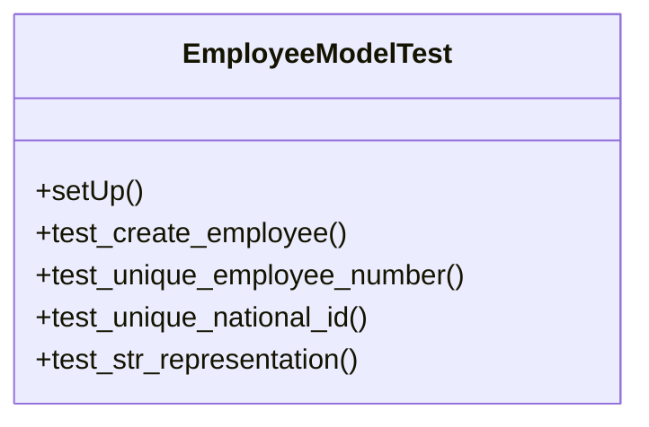

# services_modules.hr.tests.test_employee

## Imports
- core_modules.companies.models
- datetime
- django.conf
- django.db
- django.test
- django.utils
- models.department
- models.employee
- models.position

## Classes
- EmployeeModelTest
  - method: `setUp`
  - method: `test_create_employee`
  - method: `test_unique_employee_number`
  - method: `test_unique_national_id`
  - method: `test_str_representation`

## Functions
- setUp
- test_create_employee
- test_unique_employee_number
- test_unique_national_id
- test_str_representation

## Class Diagram

