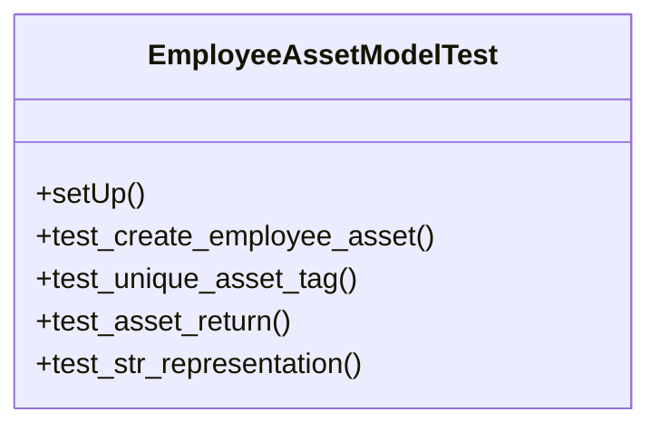

# services_modules.hr.tests.test_employee_asset

## Imports
- datetime
- django.db
- django.test
- django.utils
- models.department
- models.employee
- models.employee_asset
- models.position
- services_modules.core.models.branch
- services_modules.core.models.company

## Classes
- EmployeeAssetModelTest
  - method: `setUp`
  - method: `test_create_employee_asset`
  - method: `test_unique_asset_tag`
  - method: `test_asset_return`
  - method: `test_str_representation`

## Functions
- setUp
- test_create_employee_asset
- test_unique_asset_tag
- test_asset_return
- test_str_representation

## Class Diagram

