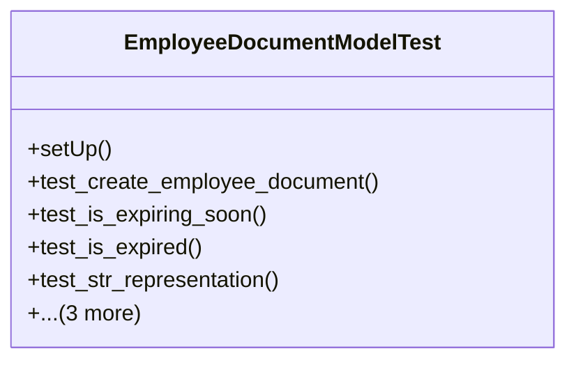

# services_modules.hr.tests.test_employee_document

## Imports
- datetime
- django.core.files.uploadedfile
- django.db
- django.test
- django.utils
- models.department
- models.employee
- models.employee_document
- models.position
- services_modules.core.models.branch
- services_modules.core.models.company

## Classes
- EmployeeDocumentModelTest
  - method: `setUp`
  - method: `test_create_employee_document`
  - method: `test_is_expiring_soon`
  - method: `test_is_expired`
  - method: `test_str_representation`
  - method: `test_unique_document_type_per_employee`
  - method: `test_document_file_handling`
  - method: `tearDown`

## Functions
- setUp
- test_create_employee_document
- test_is_expiring_soon
- test_is_expired
- test_str_representation
- test_unique_document_type_per_employee
- test_document_file_handling
- tearDown

## Class Diagram

