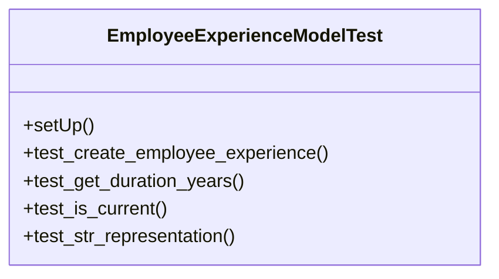

# services_modules.hr.tests.test_employee_experience

## Imports
- datetime
- django.db
- django.test
- django.utils
- models.department
- models.employee
- models.employee_experience
- models.position
- services_modules.core.models.branch
- services_modules.core.models.company

## Classes
- EmployeeExperienceModelTest
  - method: `setUp`
  - method: `test_create_employee_experience`
  - method: `test_get_duration_years`
  - method: `test_is_current`
  - method: `test_str_representation`

## Functions
- setUp
- test_create_employee_experience
- test_get_duration_years
- test_is_current
- test_str_representation

## Class Diagram

