# services_modules.hr.tests.test_hr

## Imports
- core_modules.core.models.branch
- core_modules.core.models.company
- datetime
- decimal
- django.contrib.auth
- django.core.exceptions
- django.db
- django.test
- django.utils
- models.contract
- models.department
- models.employee
- models.job
- models.leave
- models.payroll

## Classes
- DepartmentModelTest
  - method: `setUp`
  - method: `test_create_department`
  - method: `test_unique_code_per_company`
  - method: `test_department_hierarchy`
- JobModelTest
  - method: `setUp`
  - method: `test_create_job`
  - method: `test_unique_code_per_company`
- EmployeeModelTest
  - method: `setUp`
  - method: `test_create_employee`
  - method: `test_unique_employee_number_per_company`
  - method: `test_calculate_age`
  - method: `test_calculate_service_years`
- ContractModelTest
  - method: `setUp`
  - method: `test_create_contract`
  - method: `test_unique_contract_number_per_company`
  - method: `test_calculate_contract_duration`
- LeaveModelTest
  - method: `setUp`
  - method: `test_create_leave`
  - method: `test_calculate_leave_duration`
- PayrollModelTest
  - method: `setUp`
  - method: `test_create_payroll`
  - method: `test_unique_payroll_number_per_company`
- PayslipModelTest
  - method: `setUp`
  - method: `test_create_payslip`
  - method: `test_unique_payslip_number_per_company`
  - method: `test_calculate_net_salary`

## Functions
- setUp
- test_create_department
- test_unique_code_per_company
- test_department_hierarchy
- setUp
- test_create_job
- test_unique_code_per_company
- setUp
- test_create_employee
- test_unique_employee_number_per_company
- test_calculate_age
- test_calculate_service_years
- setUp
- test_create_contract
- test_unique_contract_number_per_company
- test_calculate_contract_duration
- setUp
- test_create_leave
- test_calculate_leave_duration
- setUp
- test_create_payroll
- test_unique_payroll_number_per_company
- setUp
- test_create_payslip
- test_unique_payslip_number_per_company
- test_calculate_net_salary
- mock_calculate_age
- mock_calculate_service_years
- mock_calculate_duration
- mock_calculate_duration
- mock_calculate_net_salary

## Module Variables
- `User`

## Class Diagram

```mermaid
classDiagram
    class DepartmentModelTest {
        +setUp()
        +test_create_department()
        +test_unique_code_per_company()
        +test_department_hierarchy()
    }
    class JobModelTest {
        +setUp()
        +test_create_job()
        +test_unique_code_per_company()
    }
    class EmployeeModelTest {
        +setUp()
        +test_create_employee()
        +test_unique_employee_number_per_company()
        +test_calculate_age()
        +test_calculate_service_years()
    }
    class ContractModelTest {
        +setUp()
        +test_create_contract()
        +test_unique_contract_number_per_company()
        +test_calculate_contract_duration()
    }
    class LeaveModelTest {
        +setUp()
        +test_create_leave()
        +test_calculate_leave_duration()
    }
    class PayrollModelTest {
        +setUp()
        +test_create_payroll()
        +test_unique_payroll_number_per_company()
    }
    class PayslipModelTest {
        +setUp()
        +test_create_payslip()
        +test_unique_payslip_number_per_company()
        +test_calculate_net_salary()
    }
```

