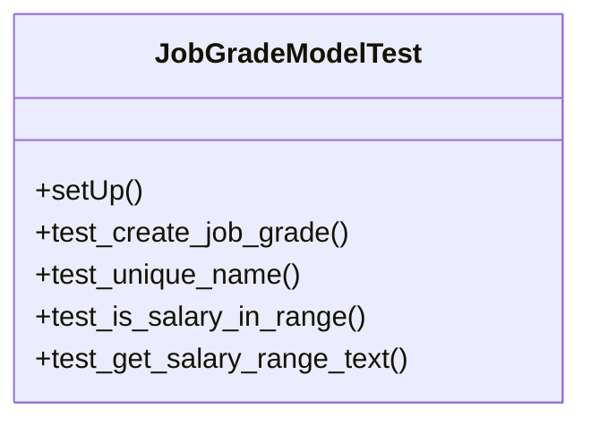

# services_modules.hr.tests.test_job_grade

## Imports
- decimal
- django.db
- django.test
- models.job_grade

## Classes
- JobGradeModelTest
  - method: `setUp`
  - method: `test_create_job_grade`
  - method: `test_unique_name`
  - method: `test_is_salary_in_range`
  - method: `test_get_salary_range_text`

## Functions
- setUp
- test_create_job_grade
- test_unique_name
- test_is_salary_in_range
- test_get_salary_range_text

## Class Diagram

