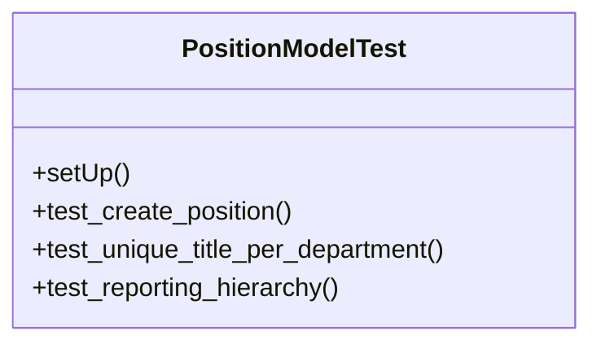

# services_modules.hr.tests.test_position

## Imports
- django.db
- django.test
- models.department
- models.job_grade
- models.position
- services_modules.core.models.company

## Classes
- PositionModelTest
  - method: `setUp`
  - method: `test_create_position`
  - method: `test_unique_title_per_department`
  - method: `test_reporting_hierarchy`

## Functions
- setUp
- test_create_position
- test_unique_title_per_department
- test_reporting_hierarchy

## Class Diagram

