# services_modules.hr.views

## Imports
- django.conf
- django.core.exceptions
- django.db
- django.shortcuts
- django.utils
- django_filters.rest_framework
- models
- rest_framework
- rest_framework.decorators
- rest_framework.exceptions
- rest_framework.response
- serializers
- services
- shared.permissions.drf_permissions
- shared.permissions.services

## Classes
- OptimizedQueryMixin
  - method: `get_queryset`
- CompanyFilterMixin
  - method: `get_queryset`
- HRPermissionMixin
  - method: `check_hr_permission`
- DepartmentViewSet
  - attr: `queryset`
  - attr: `serializer_class`
  - attr: `permission_classes`
  - attr: `filter_backends`
  - attr: `filterset_fields`
  - attr: `search_fields`
  - attr: `ordering_fields`
  - attr: `select_related_fields`
  - attr: `prefetch_related_fields`
  - method: `get_queryset`
- JobGradeViewSet
  - attr: `queryset`
  - attr: `serializer_class`
  - attr: `permission_classes`
  - attr: `filter_backends`
  - attr: `search_fields`
  - attr: `ordering_fields`
- PositionViewSet
  - attr: `queryset`
  - attr: `serializer_class`
  - attr: `permission_classes`
  - attr: `filter_backends`
  - attr: `filterset_fields`
  - attr: `search_fields`
  - attr: `ordering_fields`
  - attr: `select_related_fields`
- EmployeeViewSet
  - attr: `queryset`
  - attr: `serializer_class`
  - attr: `permission_classes`
  - attr: `filter_backends`
  - attr: `filterset_fields`
  - attr: `search_fields`
  - attr: `ordering_fields`
  - attr: `select_related_fields`
  - attr: `prefetch_related_fields`
  - method: `get_queryset`
  - method: `terminate`
  - method: `payroll_summary`
  - method: `leave_balance`
- EmployeeRelatedViewSet
  - attr: `permission_classes`
  - method: `get_employee`
  - method: `get_queryset`
  - method: `get_base_queryset`
  - method: `perform_create`
- EmployeeDocumentViewSet
  - attr: `serializer_class`
  - attr: `queryset`
  - method: `get_base_queryset`
- EmployeeExperienceViewSet
  - attr: `serializer_class`
  - attr: `queryset`
  - attr: `ordering_fields`
  - method: `get_base_queryset`
- EmployeeQualificationViewSet
  - attr: `serializer_class`
  - attr: `queryset`
  - method: `get_base_queryset`
- EmployeeTrainingViewSet
  - attr: `serializer_class`
  - attr: `queryset`
  - attr: `ordering_fields`
  - method: `get_base_queryset`
- EmployeeAssetViewSet
  - attr: `serializer_class`
  - attr: `queryset`
  - attr: `filter_backends`
  - attr: `filterset_fields`
  - method: `get_base_queryset`
- ContractViewSet
  - attr: `serializer_class`
  - attr: `queryset`
  - attr: `filter_backends`
  - attr: `filterset_fields`
  - attr: `ordering_fields`
  - method: `get_base_queryset`
- LeaveBalanceViewSet
  - attr: `serializer_class`
  - attr: `queryset`
  - attr: `filter_backends`
  - attr: `filterset_fields`
  - attr: `ordering_fields`
  - method: `get_base_queryset`
- LeaveRequestViewSet
  - attr: `serializer_class`
  - attr: `queryset`
  - attr: `filter_backends`
  - attr: `filterset_fields`
  - attr: `ordering_fields`
  - attr: `select_related_fields`
  - method: `get_base_queryset`
  - method: `approve`
- PayrollPeriodViewSet
  - attr: `queryset`
  - attr: `serializer_class`
  - attr: `permission_classes`
  - attr: `filter_backends`
  - attr: `filterset_fields`
  - attr: `ordering_fields`
  - method: `get_permissions`
  - method: `perform_create`
- SalaryComponentViewSet
  - attr: `queryset`
  - attr: `serializer_class`
  - attr: `permission_classes`
  - attr: `filter_backends`
  - attr: `filterset_fields`
  - attr: `search_fields`
  - attr: `ordering_fields`
- PayslipViewSet
  - attr: `queryset`
  - attr: `serializer_class`
  - attr: `permission_classes`
  - attr: `filter_backends`
  - attr: `filterset_fields`
  - attr: `ordering_fields`
  - attr: `select_related_fields`
  - attr: `prefetch_related_fields`
  - method: `get_queryset`
- LeaveTypeViewSet
  - attr: `queryset`
  - attr: `serializer_class`
  - attr: `permission_classes`
  - attr: `filter_backends`
  - attr: `filterset_fields`
  - attr: `search_fields`
  - attr: `ordering_fields`
- AttendanceRecordViewSet
  - attr: `queryset`
  - attr: `serializer_class`
  - attr: `permission_classes`
  - attr: `filter_backends`
  - attr: `filterset_fields`
  - attr: `ordering_fields`
  - attr: `select_related_fields`
  - method: `get_queryset`
  - method: `bulk_create`
- HRSettingViewSet
  - attr: `queryset`
  - attr: `serializer_class`
  - method: `get_permissions`
  - method: `check_permissions`
- TaxBracketViewSet
  - attr: `queryset`
  - attr: `serializer_class`
  - attr: `permission_classes`
  - attr: `filter_backends`
  - attr: `filterset_fields`
  - attr: `ordering_fields`
- SocialInsuranceSettingViewSet
  - attr: `queryset`
  - attr: `serializer_class`
  - attr: `permission_classes`
  - attr: `filter_backends`
  - attr: `filterset_fields`
  - attr: `ordering_fields`
- QueryCountMixin
  - method: `dispatch`
- PermissionService
  - method: `user_has_permission`
- EmployeeService
  - method: `terminate_employee`
  - method: `get_employee_payroll_summary`
- PayrollService
  - method: `get_employee_payroll_summary`
- LeaveService
  - method: `get_employee_leave_balance`
  - method: `approve_leave_request`
- AttendanceService
  - method: `bulk_create_records`

## Functions
- get_queryset
- get_queryset
- check_hr_permission
- get_queryset
- get_queryset
- terminate
- payroll_summary
- leave_balance
- get_employee
- get_queryset
- get_base_queryset
- perform_create
- get_base_queryset
- get_base_queryset
- get_base_queryset
- get_base_queryset
- get_base_queryset
- get_base_queryset
- get_base_queryset
- get_base_queryset
- approve
- get_permissions
- perform_create
- get_queryset
- get_queryset
- bulk_create
- get_permissions
- check_permissions
- dispatch
- user_has_permission
- terminate_employee
- get_employee_payroll_summary
- get_employee_payroll_summary
- get_employee_leave_balance
- approve_leave_request
- bulk_create_records

## Class Diagram

```mermaid
classDiagram
    class OptimizedQueryMixin {
        +get_queryset()
    }
    class CompanyFilterMixin {
        +get_queryset()
    }
    class HRPermissionMixin {
        +check_hr_permission()
    }
    class DepartmentViewSet {
        +queryset
        +serializer_class
        +permission_classes
        +filter_backends
        +filterset_fields
        +... (4 more)
        +get_queryset()
    }
    class JobGradeViewSet {
        +queryset
        +serializer_class
        +permission_classes
        +filter_backends
        +search_fields
        +... (1 more)
    }
    class PositionViewSet {
        +queryset
        +serializer_class
        +permission_classes
        +filter_backends
        +filterset_fields
        +... (3 more)
    }
    class EmployeeViewSet {
        +queryset
        +serializer_class
        +permission_classes
        +filter_backends
        +filterset_fields
        +... (4 more)
        +get_queryset()
        +terminate()
        +payroll_summary()
        +leave_balance()
    }
    class EmployeeRelatedViewSet {
        +permission_classes
        +get_employee()
        +get_queryset()
        +get_base_queryset()
        +perform_create()
    }
    class EmployeeDocumentViewSet {
        +serializer_class
        +queryset
        +get_base_queryset()
    }
    class EmployeeExperienceViewSet {
        +serializer_class
        +queryset
        +ordering_fields
        +get_base_queryset()
    }
    class EmployeeQualificationViewSet {
        +serializer_class
        +queryset
        +get_base_queryset()
    }
    class EmployeeTrainingViewSet {
        +serializer_class
        +queryset
        +ordering_fields
        +get_base_queryset()
    }
    class EmployeeAssetViewSet {
        +serializer_class
        +queryset
        +filter_backends
        +filterset_fields
        +get_base_queryset()
    }
    class ContractViewSet {
        +serializer_class
        +queryset
        +filter_backends
        +filterset_fields
        +ordering_fields
        +get_base_queryset()
    }
    class LeaveBalanceViewSet {
        +serializer_class
        +queryset
        +filter_backends
        +filterset_fields
        +ordering_fields
        +get_base_queryset()
    }
    class LeaveRequestViewSet {
        +serializer_class
        +queryset
        +filter_backends
        +filterset_fields
        +ordering_fields
        +... (1 more)
        +get_base_queryset()
        +approve()
    }
    class PayrollPeriodViewSet {
        +queryset
        +serializer_class
        +permission_classes
        +filter_backends
        +filterset_fields
        +... (1 more)
        +get_permissions()
        +perform_create()
    }
    class SalaryComponentViewSet {
        +queryset
        +serializer_class
        +permission_classes
        +filter_backends
        +filterset_fields
        +... (2 more)
    }
    class PayslipViewSet {
        +queryset
        +serializer_class
        +permission_classes
        +filter_backends
        +filterset_fields
        +... (3 more)
        +get_queryset()
    }
    class LeaveTypeViewSet {
        +queryset
        +serializer_class
        +permission_classes
        +filter_backends
        +filterset_fields
        +... (2 more)
    }
    class AttendanceRecordViewSet {
        +queryset
        +serializer_class
        +permission_classes
        +filter_backends
        +filterset_fields
        +... (2 more)
        +get_queryset()
        +bulk_create()
    }
    class HRSettingViewSet {
        +queryset
        +serializer_class
        +get_permissions()
        +check_permissions()
    }
    class TaxBracketViewSet {
        +queryset
        +serializer_class
        +permission_classes
        +filter_backends
        +filterset_fields
        +... (1 more)
    }
    class SocialInsuranceSettingViewSet {
        +queryset
        +serializer_class
        +permission_classes
        +filter_backends
        +filterset_fields
        +... (1 more)
    }
    class QueryCountMixin {
        +dispatch()
    }
    class PermissionService {
        +user_has_permission()
    }
    class EmployeeService {
        +terminate_employee()
        +get_employee_payroll_summary()
    }
    class PayrollService {
        +get_employee_payroll_summary()
    }
    class LeaveService {
        +get_employee_leave_balance()
        +approve_leave_request()
    }
    class AttendanceService {
        +bulk_create_records()
    }
```

