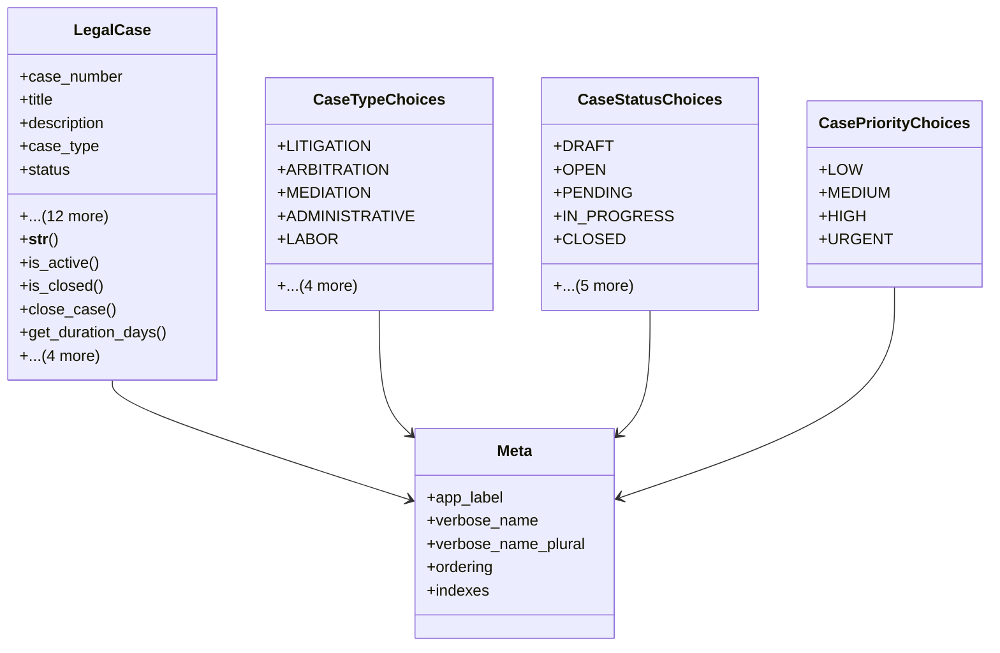

# services_modules.legal_affairs.models.legal_case

## Imports
- core_modules.companies.models
- core_modules.core.models.base_models
- django.db
- django.utils
- django.utils.translation

## Classes
- LegalCase
  - attr: `case_number`
  - attr: `title`
  - attr: `description`
  - attr: `case_type`
  - attr: `status`
  - attr: `priority`
  - attr: `filing_date`
  - attr: `closing_date`
  - attr: `court_name`
  - attr: `court_case_number`
  - attr: `jurisdiction`
  - attr: `company`
  - attr: `assigned_lawyer`
  - attr: `estimated_cost`
  - attr: `actual_cost`
  - attr: `notes`
  - attr: `is_confidential`
  - method: `__str__`
  - method: `is_active`
  - method: `is_closed`
  - method: `close_case`
  - method: `get_duration_days`
  - method: `get_related_documents`
  - method: `get_related_sessions`
  - method: `get_related_parties`
  - method: `get_next_session`
- CaseTypeChoices
  - attr: `LITIGATION`
  - attr: `ARBITRATION`
  - attr: `MEDIATION`
  - attr: `ADMINISTRATIVE`
  - attr: `LABOR`
  - attr: `COMMERCIAL`
  - attr: `CIVIL`
  - attr: `CRIMINAL`
  - attr: `OTHER`
- CaseStatusChoices
  - attr: `DRAFT`
  - attr: `OPEN`
  - attr: `PENDING`
  - attr: `IN_PROGRESS`
  - attr: `CLOSED`
  - attr: `WON`
  - attr: `LOST`
  - attr: `SETTLED`
  - attr: `APPEALED`
  - attr: `WITHDRAWN`
- CasePriorityChoices
  - attr: `LOW`
  - attr: `MEDIUM`
  - attr: `HIGH`
  - attr: `URGENT`
- Meta
  - attr: `app_label`
  - attr: `verbose_name`
  - attr: `verbose_name_plural`
  - attr: `ordering`
  - attr: `indexes`

## Functions
- __str__
- is_active
- is_closed
- close_case
- get_duration_days
- get_related_documents
- get_related_sessions
- get_related_parties
- get_next_session

## Class Diagram

