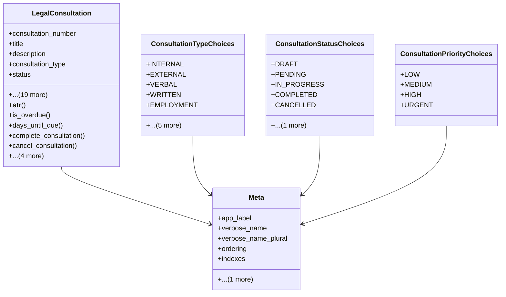

# services_modules.legal_affairs.models.legal_consultation

## Imports
- core_modules.companies.models
- core_modules.core.models.base_models
- django.core.exceptions
- django.db
- django.utils
- django.utils.translation

## Classes
- LegalConsultation
  - attr: `consultation_number`
  - attr: `title`
  - attr: `description`
  - attr: `consultation_type`
  - attr: `status`
  - attr: `priority`
  - attr: `request_date`
  - attr: `due_date`
  - attr: `completion_date`
  - attr: `requester_name`
  - attr: `requester_department`
  - attr: `requester_contact`
  - attr: `company`
  - attr: `assigned_lawyer`
  - attr: `legal_case`
  - attr: `question`
  - attr: `answer`
  - attr: `legal_basis`
  - attr: `recommendations`
  - attr: `is_billable`
  - attr: `billing_amount`
  - attr: `time_spent_hours`
  - attr: `notes`
  - attr: `is_confidential`
  - method: `__str__`
  - method: `is_overdue`
  - method: `days_until_due`
  - method: `complete_consultation`
  - method: `cancel_consultation`
  - method: `assign_lawyer`
  - method: `calculate_billing_amount`
  - method: `get_related_documents`
  - method: `clean`
- ConsultationTypeChoices
  - attr: `INTERNAL`
  - attr: `EXTERNAL`
  - attr: `VERBAL`
  - attr: `WRITTEN`
  - attr: `EMPLOYMENT`
  - attr: `COMMERCIAL`
  - attr: `CIVIL`
  - attr: `CRIMINAL`
  - attr: `ADMINISTRATIVE`
  - attr: `OTHER`
- ConsultationStatusChoices
  - attr: `DRAFT`
  - attr: `PENDING`
  - attr: `IN_PROGRESS`
  - attr: `COMPLETED`
  - attr: `CANCELLED`
  - attr: `REFERRED`
- ConsultationPriorityChoices
  - attr: `LOW`
  - attr: `MEDIUM`
  - attr: `HIGH`
  - attr: `URGENT`
- Meta
  - attr: `app_label`
  - attr: `verbose_name`
  - attr: `verbose_name_plural`
  - attr: `ordering`
  - attr: `indexes`
  - attr: `permissions`

## Functions
- __str__
- is_overdue
- days_until_due
- complete_consultation
- cancel_consultation
- assign_lawyer
- calculate_billing_amount
- get_related_documents
- clean

## Class Diagram

