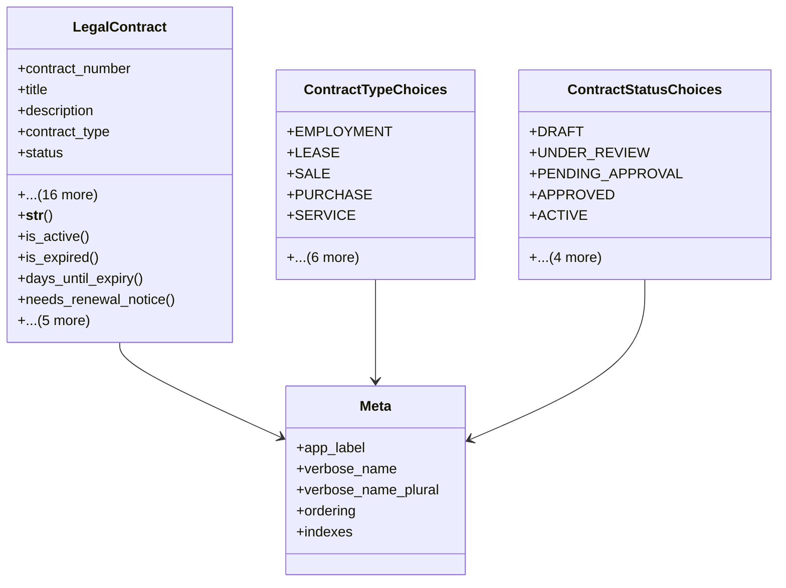

# services_modules.legal_affairs.models.legal_contract

## Imports
- core_modules.core.models.base_models
- core_modules.core.models.company
- django.db
- django.utils
- django.utils.translation

## Classes
- LegalContract
  - attr: `contract_number`
  - attr: `title`
  - attr: `description`
  - attr: `contract_type`
  - attr: `status`
  - attr: `signing_date`
  - attr: `effective_date`
  - attr: `expiry_date`
  - attr: `termination_date`
  - attr: `first_party_name`
  - attr: `second_party_name`
  - attr: `company`
  - attr: `legal_case`
  - attr: `assigned_lawyer`
  - attr: `value`
  - attr: `currency`
  - attr: `auto_renewal`
  - attr: `renewal_period_months`
  - attr: `notice_period_days`
  - attr: `notes`
  - attr: `is_confidential`
  - method: `__str__`
  - method: `is_active`
  - method: `is_expired`
  - method: `days_until_expiry`
  - method: `needs_renewal_notice`
  - method: `renew_contract`
  - method: `terminate_contract`
  - method: `get_duration_months`
  - method: `get_related_documents`
  - method: `get_related_parties`
- ContractTypeChoices
  - attr: `EMPLOYMENT`
  - attr: `LEASE`
  - attr: `SALE`
  - attr: `PURCHASE`
  - attr: `SERVICE`
  - attr: `PARTNERSHIP`
  - attr: `DISTRIBUTION`
  - attr: `LICENSING`
  - attr: `CONFIDENTIALITY`
  - attr: `SETTLEMENT`
  - attr: `OTHER`
- ContractStatusChoices
  - attr: `DRAFT`
  - attr: `UNDER_REVIEW`
  - attr: `PENDING_APPROVAL`
  - attr: `APPROVED`
  - attr: `ACTIVE`
  - attr: `EXPIRED`
  - attr: `TERMINATED`
  - attr: `RENEWED`
  - attr: `CANCELLED`
- Meta
  - attr: `app_label`
  - attr: `verbose_name`
  - attr: `verbose_name_plural`
  - attr: `ordering`
  - attr: `indexes`

## Functions
- __str__
- is_active
- is_expired
- days_until_expiry
- needs_renewal_notice
- renew_contract
- terminate_contract
- get_duration_months
- get_related_documents
- get_related_parties

## Class Diagram

