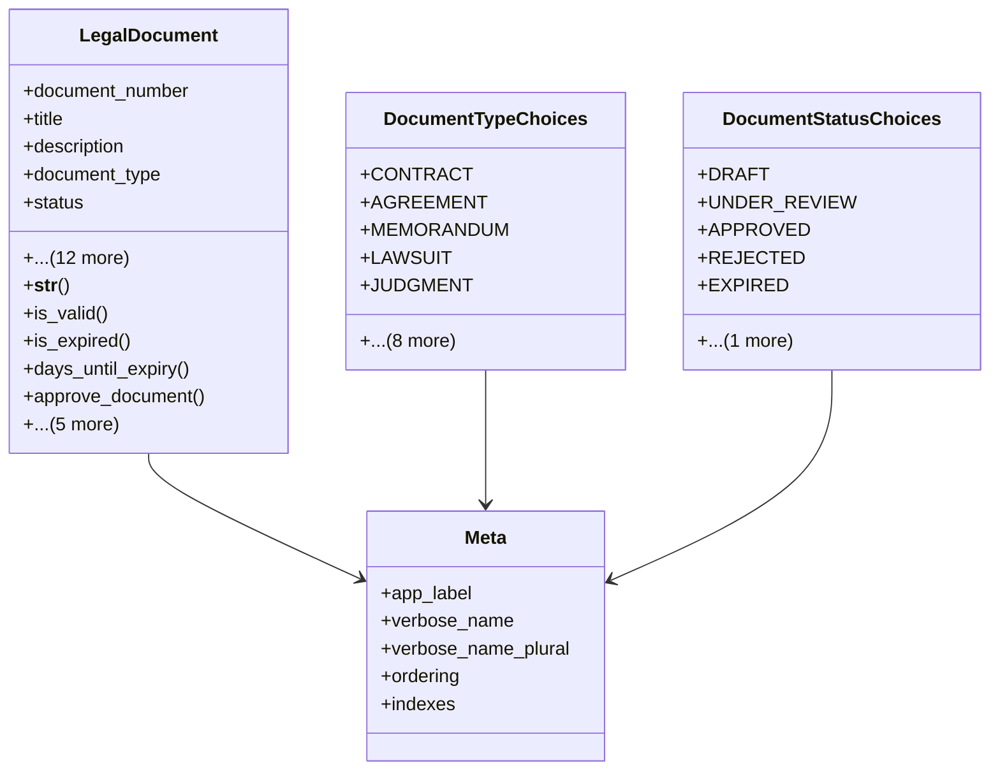

# services_modules.legal_affairs.models.legal_document

## Imports
- core_modules.core.models.base_models
- django.db
- django.utils
- django.utils.translation

## Classes
- LegalDocument
  - attr: `document_number`
  - attr: `title`
  - attr: `description`
  - attr: `document_type`
  - attr: `status`
  - attr: `issue_date`
  - attr: `expiry_date`
  - attr: `file`
  - attr: `file_name`
  - attr: `file_type`
  - attr: `file_size`
  - attr: `legal_case`
  - attr: `legal_contract`
  - attr: `reference_number`
  - attr: `issuing_authority`
  - attr: `notes`
  - attr: `is_confidential`
  - method: `__str__`
  - method: `is_valid`
  - method: `is_expired`
  - method: `days_until_expiry`
  - method: `approve_document`
  - method: `reject_document`
  - method: `archive_document`
  - method: `get_file_extension`
  - method: `is_pdf`
  - method: `get_related_case_or_contract`
- DocumentTypeChoices
  - attr: `CONTRACT`
  - attr: `AGREEMENT`
  - attr: `MEMORANDUM`
  - attr: `LAWSUIT`
  - attr: `JUDGMENT`
  - attr: `POWER_OF_ATTORNEY`
  - attr: `LEGAL_OPINION`
  - attr: `MINUTES`
  - attr: `CORRESPONDENCE`
  - attr: `REPORT`
  - attr: `CERTIFICATE`
  - attr: `LICENSE`
  - attr: `OTHER`
- DocumentStatusChoices
  - attr: `DRAFT`
  - attr: `UNDER_REVIEW`
  - attr: `APPROVED`
  - attr: `REJECTED`
  - attr: `EXPIRED`
  - attr: `ARCHIVED`
- Meta
  - attr: `app_label`
  - attr: `verbose_name`
  - attr: `verbose_name_plural`
  - attr: `ordering`
  - attr: `indexes`

## Functions
- __str__
- is_valid
- is_expired
- days_until_expiry
- approve_document
- reject_document
- archive_document
- get_file_extension
- is_pdf
- get_related_case_or_contract

## Class Diagram

