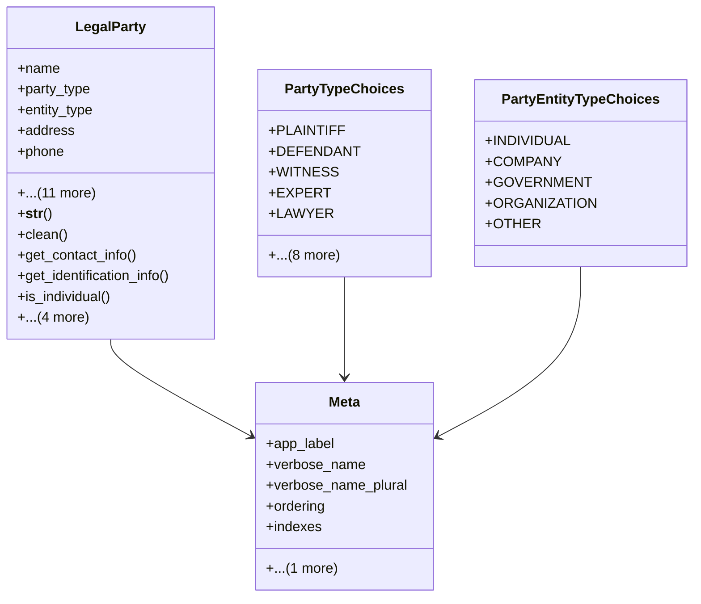

# services_modules.legal_affairs.models.legal_party

## Imports
- core_modules.core.models.base_models
- django.core.exceptions
- django.db
- django.utils.translation

## Classes
- LegalParty
  - attr: `name`
  - attr: `party_type`
  - attr: `entity_type`
  - attr: `address`
  - attr: `phone`
  - attr: `email`
  - attr: `id_number`
  - attr: `id_type`
  - attr: `nationality`
  - attr: `registration_number`
  - attr: `tax_number`
  - attr: `representative_name`
  - attr: `legal_case`
  - attr: `legal_contract`
  - attr: `notes`
  - attr: `is_confidential`
  - method: `__str__`
  - method: `clean`
  - method: `get_contact_info`
  - method: `get_identification_info`
  - method: `is_individual`
  - method: `is_company`
  - method: `is_government`
  - method: `get_related_case_or_contract`
  - method: `get_related_documents`
- PartyTypeChoices
  - attr: `PLAINTIFF`
  - attr: `DEFENDANT`
  - attr: `WITNESS`
  - attr: `EXPERT`
  - attr: `LAWYER`
  - attr: `JUDGE`
  - attr: `ARBITRATOR`
  - attr: `MEDIATOR`
  - attr: `CONSULTANT`
  - attr: `FIRST_PARTY`
  - attr: `SECOND_PARTY`
  - attr: `THIRD_PARTY`
  - attr: `OTHER`
- PartyEntityTypeChoices
  - attr: `INDIVIDUAL`
  - attr: `COMPANY`
  - attr: `GOVERNMENT`
  - attr: `ORGANIZATION`
  - attr: `OTHER`
- Meta
  - attr: `app_label`
  - attr: `verbose_name`
  - attr: `verbose_name_plural`
  - attr: `ordering`
  - attr: `indexes`
  - attr: `permissions`

## Functions
- __str__
- clean
- get_contact_info
- get_identification_info
- is_individual
- is_company
- is_government
- get_related_case_or_contract
- get_related_documents

## Class Diagram

