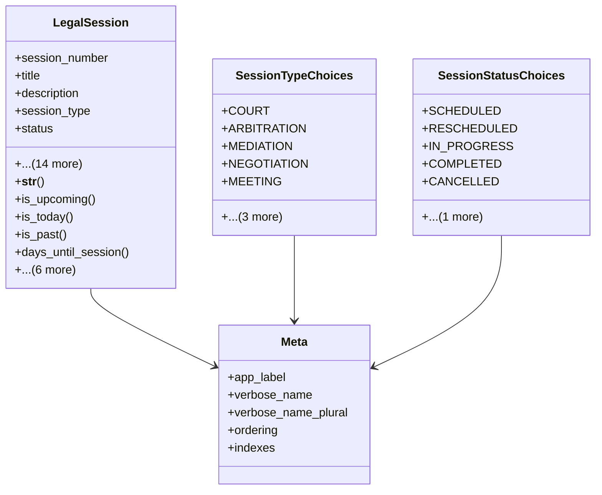

# services_modules.legal_affairs.models.legal_session

## Imports
- core_modules.core.models.base_models
- django.db
- django.utils
- django.utils.translation

## Classes
- LegalSession
  - attr: `session_number`
  - attr: `title`
  - attr: `description`
  - attr: `session_type`
  - attr: `status`
  - attr: `session_date`
  - attr: `start_time`
  - attr: `end_time`
  - attr: `duration_minutes`
  - attr: `location`
  - attr: `room`
  - attr: `is_virtual`
  - attr: `virtual_meeting_link`
  - attr: `legal_case`
  - attr: `assigned_lawyer`
  - attr: `agenda`
  - attr: `outcome`
  - attr: `next_steps`
  - attr: `notes`
  - method: `__str__`
  - method: `is_upcoming`
  - method: `is_today`
  - method: `is_past`
  - method: `days_until_session`
  - method: `complete_session`
  - method: `cancel_session`
  - method: `postpone_session`
  - method: `reschedule_session`
  - method: `get_duration_str`
  - method: `get_related_documents`
- SessionTypeChoices
  - attr: `COURT`
  - attr: `ARBITRATION`
  - attr: `MEDIATION`
  - attr: `NEGOTIATION`
  - attr: `MEETING`
  - attr: `HEARING`
  - attr: `DEPOSITION`
  - attr: `OTHER`
- SessionStatusChoices
  - attr: `SCHEDULED`
  - attr: `RESCHEDULED`
  - attr: `IN_PROGRESS`
  - attr: `COMPLETED`
  - attr: `CANCELLED`
  - attr: `POSTPONED`
- Meta
  - attr: `app_label`
  - attr: `verbose_name`
  - attr: `verbose_name_plural`
  - attr: `ordering`
  - attr: `indexes`

## Functions
- __str__
- is_upcoming
- is_today
- is_past
- days_until_session
- complete_session
- cancel_session
- postpone_session
- reschedule_session
- get_duration_str
- get_related_documents

## Class Diagram

