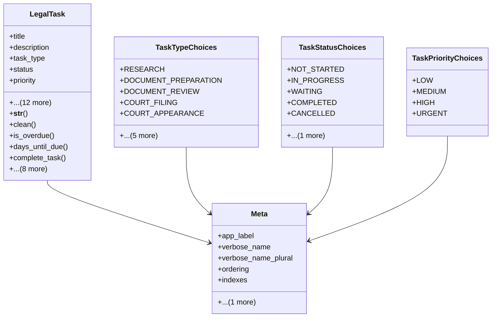

# services_modules.legal_affairs.models.legal_task

## Imports
- core_modules.core.models.base_models
- django.core.exceptions
- django.db
- django.utils
- django.utils.translation

## Classes
- LegalTask
  - attr: `title`
  - attr: `description`
  - attr: `task_type`
  - attr: `status`
  - attr: `priority`
  - attr: `due_date`
  - attr: `start_date`
  - attr: `completion_date`
  - attr: `assigned_to`
  - attr: `legal_case`
  - attr: `legal_contract`
  - attr: `legal_consultation`
  - attr: `parent_task`
  - attr: `estimated_hours`
  - attr: `actual_hours`
  - attr: `completion_percentage`
  - attr: `notes`
  - method: `__str__`
  - method: `clean`
  - method: `is_overdue`
  - method: `days_until_due`
  - method: `complete_task`
  - method: `cancel_task`
  - method: `start_task`
  - method: `update_progress`
  - method: `defer_task`
  - method: `get_related_entity`
  - method: `get_all_subtasks`
  - method: `has_subtasks`
  - method: `get_task_path`
- TaskTypeChoices
  - attr: `RESEARCH`
  - attr: `DOCUMENT_PREPARATION`
  - attr: `DOCUMENT_REVIEW`
  - attr: `COURT_FILING`
  - attr: `COURT_APPEARANCE`
  - attr: `CLIENT_MEETING`
  - attr: `NEGOTIATION`
  - attr: `CONSULTATION`
  - attr: `FOLLOW_UP`
  - attr: `OTHER`
- TaskStatusChoices
  - attr: `NOT_STARTED`
  - attr: `IN_PROGRESS`
  - attr: `WAITING`
  - attr: `COMPLETED`
  - attr: `CANCELLED`
  - attr: `DEFERRED`
- TaskPriorityChoices
  - attr: `LOW`
  - attr: `MEDIUM`
  - attr: `HIGH`
  - attr: `URGENT`
- Meta
  - attr: `app_label`
  - attr: `verbose_name`
  - attr: `verbose_name_plural`
  - attr: `ordering`
  - attr: `indexes`
  - attr: `permissions`

## Functions
- __str__
- clean
- is_overdue
- days_until_due
- complete_task
- cancel_task
- start_task
- update_progress
- defer_task
- get_related_entity
- get_all_subtasks
- has_subtasks
- get_task_path

## Class Diagram

