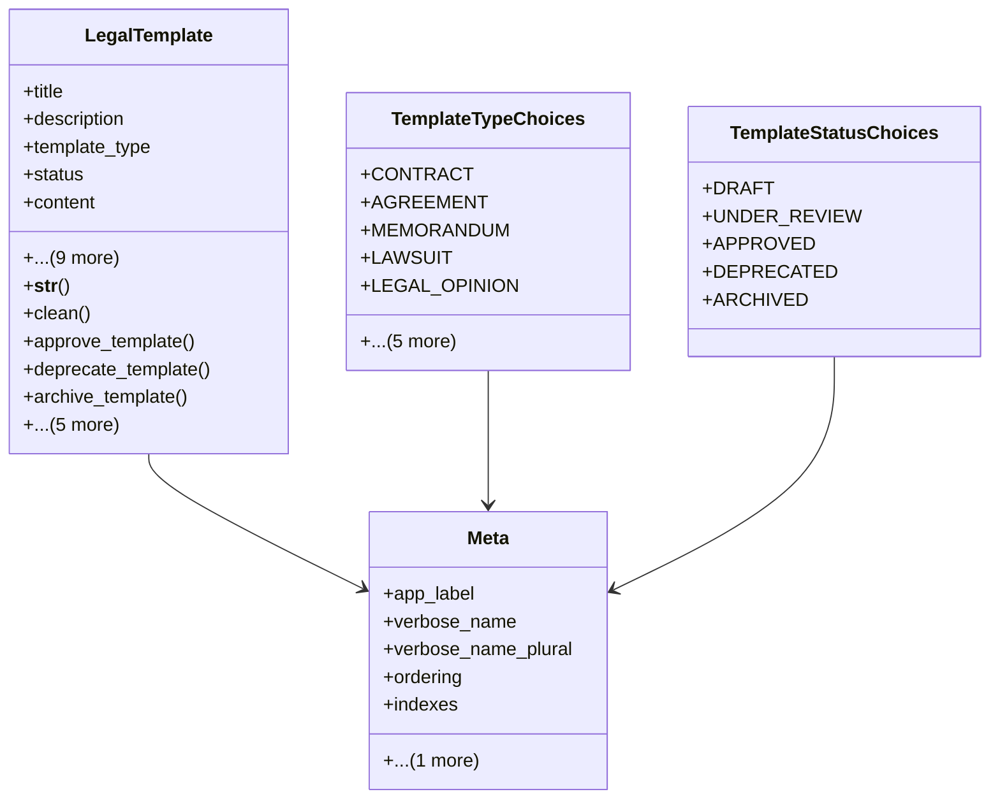

# services_modules.legal_affairs.models.legal_template

## Imports
- core_modules.companies.models
- core_modules.core.models.base_models
- django.core.exceptions
- django.db
- django.utils.translation
- re

## Classes
- LegalTemplate
  - attr: `title`
  - attr: `description`
  - attr: `template_type`
  - attr: `status`
  - attr: `content`
  - attr: `file`
  - attr: `version`
  - attr: `previous_version`
  - attr: `company`
  - attr: `tags`
  - attr: `language`
  - attr: `jurisdiction`
  - attr: `notes`
  - attr: `is_confidential`
  - method: `__str__`
  - method: `clean`
  - method: `approve_template`
  - method: `deprecate_template`
  - method: `archive_template`
  - method: `create_new_version`
  - method: `get_version_history`
  - method: `get_placeholders`
  - method: `render_template`
  - method: `get_tag_list`
- TemplateTypeChoices
  - attr: `CONTRACT`
  - attr: `AGREEMENT`
  - attr: `MEMORANDUM`
  - attr: `LAWSUIT`
  - attr: `LEGAL_OPINION`
  - attr: `LETTER`
  - attr: `NOTICE`
  - attr: `POWER_OF_ATTORNEY`
  - attr: `MINUTES`
  - attr: `OTHER`
- TemplateStatusChoices
  - attr: `DRAFT`
  - attr: `UNDER_REVIEW`
  - attr: `APPROVED`
  - attr: `DEPRECATED`
  - attr: `ARCHIVED`
- Meta
  - attr: `app_label`
  - attr: `verbose_name`
  - attr: `verbose_name_plural`
  - attr: `ordering`
  - attr: `indexes`
  - attr: `permissions`

## Functions
- __str__
- clean
- approve_template
- deprecate_template
- archive_template
- create_new_version
- get_version_history
- get_placeholders
- render_template
- get_tag_list

## Class Diagram

