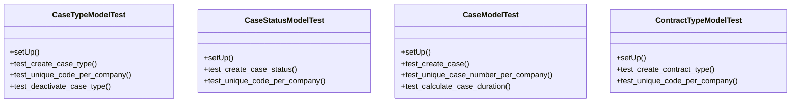

# services_modules.legal_affairs.tests.test_legal_affairs

## Imports
- core_modules.core.models
- datetime
- decimal
- django.contrib.auth
- django.core.exceptions
- django.db
- django.test
- django.utils
- models.legal_case
- models.legal_consultation
- models.legal_contract
- models.legal_document

## Classes
- CaseTypeModelTest
  - method: `setUp`
  - method: `test_create_case_type`
  - method: `test_unique_code_per_company`
  - method: `test_deactivate_case_type`
- CaseStatusModelTest
  - method: `setUp`
  - method: `test_create_case_status`
  - method: `test_unique_code_per_company`
- CaseModelTest
  - method: `setUp`
  - method: `test_create_case`
  - method: `test_unique_case_number_per_company`
  - method: `test_calculate_case_duration`
- ContractTypeModelTest
  - method: `setUp`
  - method: `test_create_contract_type`
  - method: `test_unique_code_per_company`

## Functions
- setUp
- test_create_case_type
- test_unique_code_per_company
- test_deactivate_case_type
- setUp
- test_create_case_status
- test_unique_code_per_company
- setUp
- test_create_case
- test_unique_case_number_per_company
- test_calculate_case_duration
- setUp
- test_create_contract_type
- test_unique_code_per_company
- mock_calculate_duration

## Module Variables
- `User`

## Class Diagram

