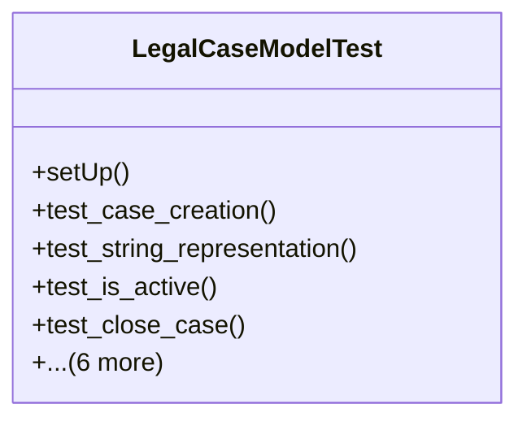

# services_modules.legal_affairs.tests.test_legal_case

## Imports
- core_modules.core.models.company
- django.contrib.auth.models
- django.core.exceptions
- django.test
- django.utils
- services_modules.legal_affairs.models.legal_case

## Classes
- LegalCaseModelTest
  - method: `setUp`
  - method: `test_case_creation`
  - method: `test_string_representation`
  - method: `test_is_active`
  - method: `test_close_case`
  - method: `test_reopen_case`
  - method: `test_update_status`
  - method: `test_days_since_filing`
  - method: `test_validation_error_on_invalid_dates`
  - method: `test_assign_lawyer`
  - method: `test_calculate_risk_level`

## Functions
- setUp
- test_case_creation
- test_string_representation
- test_is_active
- test_close_case
- test_reopen_case
- test_update_status
- test_days_since_filing
- test_validation_error_on_invalid_dates
- test_assign_lawyer
- test_calculate_risk_level

## Class Diagram

