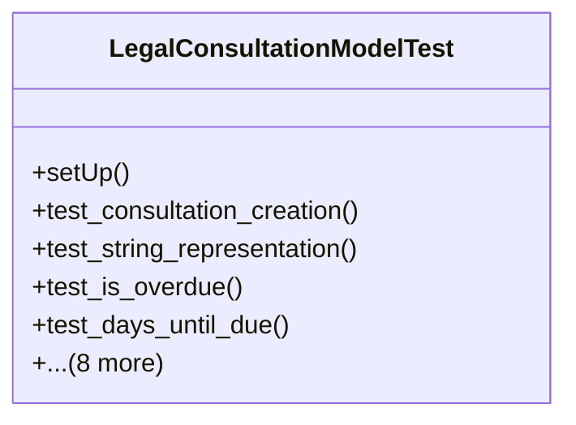

# services_modules.legal_affairs.tests.test_legal_consultation

## Imports
- core_modules.core.models.company
- django.contrib.auth.models
- django.core.exceptions
- django.test
- django.utils
- services_modules.legal_affairs.models.legal_case
- services_modules.legal_affairs.models.legal_consultation

## Classes
- LegalConsultationModelTest
  - method: `setUp`
  - method: `test_consultation_creation`
  - method: `test_string_representation`
  - method: `test_is_overdue`
  - method: `test_days_until_due`
  - method: `test_complete_consultation`
  - method: `test_cancel_consultation`
  - method: `test_assign_lawyer`
  - method: `test_calculate_billing_amount`
  - method: `test_get_related_documents`
  - method: `test_validation_error_on_invalid_dates`
  - method: `test_validation_error_on_negative_values`
  - method: `test_validation_error_on_completed_without_answer`

## Functions
- setUp
- test_consultation_creation
- test_string_representation
- test_is_overdue
- test_days_until_due
- test_complete_consultation
- test_cancel_consultation
- test_assign_lawyer
- test_calculate_billing_amount
- test_get_related_documents
- test_validation_error_on_invalid_dates
- test_validation_error_on_negative_values
- test_validation_error_on_completed_without_answer

## Class Diagram

