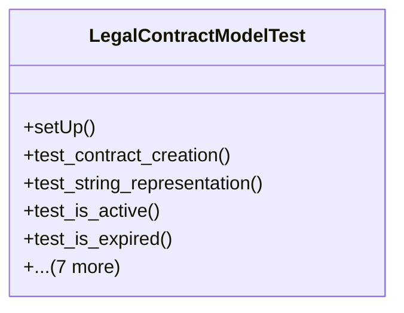

# services_modules.legal_affairs.tests.test_legal_contract

## Imports
- core_modules.core.models.company
- django.contrib.auth.models
- django.core.exceptions
- django.test
- django.utils
- services_modules.legal_affairs.models.legal_contract

## Classes
- LegalContractModelTest
  - method: `setUp`
  - method: `test_contract_creation`
  - method: `test_string_representation`
  - method: `test_is_active`
  - method: `test_is_expired`
  - method: `test_days_until_expiry`
  - method: `test_sign_contract`
  - method: `test_terminate_contract`
  - method: `test_renew_contract`
  - method: `test_validation_error_on_invalid_dates`
  - method: `test_calculate_remaining_value`
  - method: `test_calculate_contract_duration_months`

## Functions
- setUp
- test_contract_creation
- test_string_representation
- test_is_active
- test_is_expired
- test_days_until_expiry
- test_sign_contract
- test_terminate_contract
- test_renew_contract
- test_validation_error_on_invalid_dates
- test_calculate_remaining_value
- test_calculate_contract_duration_months

## Class Diagram

