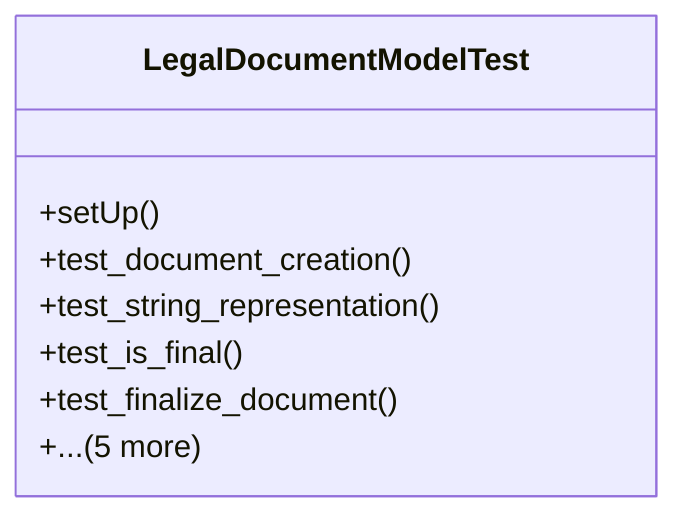

# services_modules.legal_affairs.tests.test_legal_document

## Imports
- core_modules.core.models.company
- django.contrib.auth.models
- django.core.exceptions
- django.test
- django.utils
- services_modules.legal_affairs.models.legal_case
- services_modules.legal_affairs.models.legal_document

## Classes
- LegalDocumentModelTest
  - method: `setUp`
  - method: `test_document_creation`
  - method: `test_string_representation`
  - method: `test_is_final`
  - method: `test_finalize_document`
  - method: `test_archive_document`
  - method: `test_create_revision`
  - method: `test_get_revision_history`
  - method: `test_get_latest_revision`
  - method: `test_get_related_entity`

## Functions
- setUp
- test_document_creation
- test_string_representation
- test_is_final
- test_finalize_document
- test_archive_document
- test_create_revision
- test_get_revision_history
- test_get_latest_revision
- test_get_related_entity

## Class Diagram

