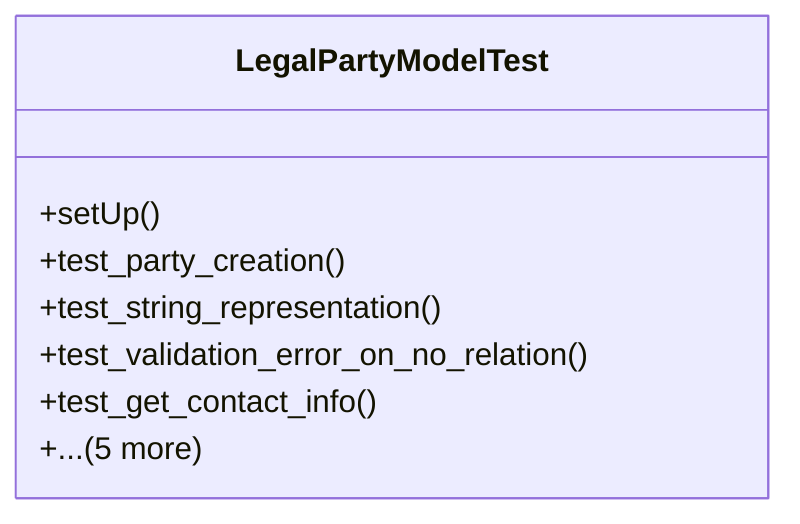

# services_modules.legal_affairs.tests.test_legal_party

## Imports
- core_modules.core.models.company
- django.contrib.auth.models
- django.core.exceptions
- django.test
- django.utils
- services_modules.legal_affairs.models.legal_case
- services_modules.legal_affairs.models.legal_contract
- services_modules.legal_affairs.models.legal_party

## Classes
- LegalPartyModelTest
  - method: `setUp`
  - method: `test_party_creation`
  - method: `test_string_representation`
  - method: `test_validation_error_on_no_relation`
  - method: `test_get_contact_info`
  - method: `test_get_identification_info`
  - method: `test_is_individual`
  - method: `test_is_company`
  - method: `test_get_related_case_or_contract`
  - method: `test_get_related_documents`

## Functions
- setUp
- test_party_creation
- test_string_representation
- test_validation_error_on_no_relation
- test_get_contact_info
- test_get_identification_info
- test_is_individual
- test_is_company
- test_get_related_case_or_contract
- test_get_related_documents

## Class Diagram

