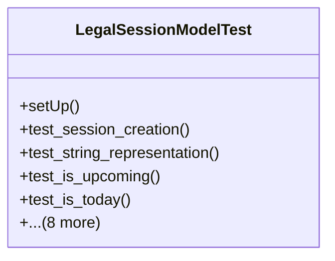

# services_modules.legal_affairs.tests.test_legal_session

## Imports
- core_modules.core.models.company
- django.contrib.auth.models
- django.core.exceptions
- django.test
- django.utils
- services_modules.legal_affairs.models.legal_case
- services_modules.legal_affairs.models.legal_session

## Classes
- LegalSessionModelTest
  - method: `setUp`
  - method: `test_session_creation`
  - method: `test_string_representation`
  - method: `test_is_upcoming`
  - method: `test_is_today`
  - method: `test_is_past`
  - method: `test_days_until_session`
  - method: `test_complete_session`
  - method: `test_cancel_session`
  - method: `test_postpone_session`
  - method: `test_reschedule_session`
  - method: `test_get_duration_str`
  - method: `test_get_related_documents`

## Functions
- setUp
- test_session_creation
- test_string_representation
- test_is_upcoming
- test_is_today
- test_is_past
- test_days_until_session
- test_complete_session
- test_cancel_session
- test_postpone_session
- test_reschedule_session
- test_get_duration_str
- test_get_related_documents

## Class Diagram

