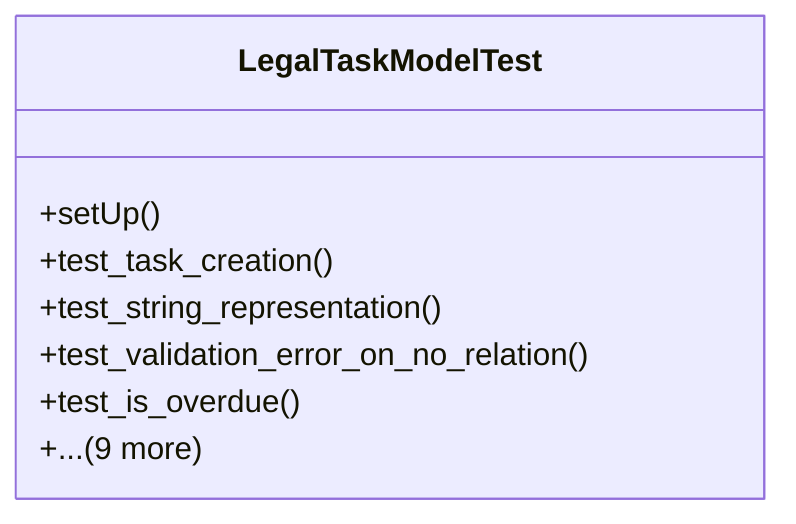

# services_modules.legal_affairs.tests.test_legal_task

## Imports
- core_modules.core.models.company
- django.contrib.auth.models
- django.core.exceptions
- django.test
- django.utils
- services_modules.legal_affairs.models.legal_case
- services_modules.legal_affairs.models.legal_contract
- services_modules.legal_affairs.models.legal_task

## Classes
- LegalTaskModelTest
  - method: `setUp`
  - method: `test_task_creation`
  - method: `test_string_representation`
  - method: `test_validation_error_on_no_relation`
  - method: `test_is_overdue`
  - method: `test_days_until_due`
  - method: `test_complete_task`
  - method: `test_cancel_task`
  - method: `test_reassign_task`
  - method: `test_update_progress`
  - method: `test_calculate_efficiency`
  - method: `test_get_related_entity`
  - method: `test_validation_error_on_invalid_dates`
  - method: `test_validation_error_on_negative_values`

## Functions
- setUp
- test_task_creation
- test_string_representation
- test_validation_error_on_no_relation
- test_is_overdue
- test_days_until_due
- test_complete_task
- test_cancel_task
- test_reassign_task
- test_update_progress
- test_calculate_efficiency
- test_get_related_entity
- test_validation_error_on_invalid_dates
- test_validation_error_on_negative_values

## Class Diagram

