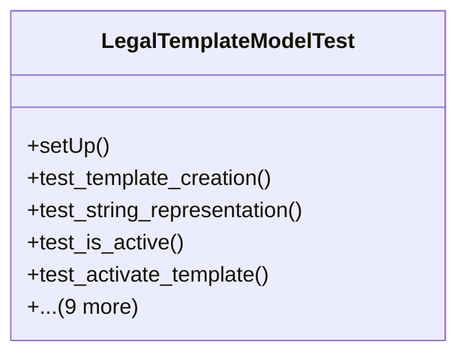

# services_modules.legal_affairs.tests.test_legal_template

## Imports
- core_modules.core.models.company
- django.contrib.auth.models
- django.core.exceptions
- django.test
- django.utils
- services_modules.legal_affairs.models.legal_template

## Classes
- LegalTemplateModelTest
  - method: `setUp`
  - method: `test_template_creation`
  - method: `test_string_representation`
  - method: `test_is_active`
  - method: `test_activate_template`
  - method: `test_deactivate_template`
  - method: `test_archive_template`
  - method: `test_create_revision`
  - method: `test_get_revision_history`
  - method: `test_get_latest_revision`
  - method: `test_get_variables_list`
  - method: `test_render_template`
  - method: `test_validation_error_on_missing_variables`
  - method: `test_validation_error_on_invalid_status_transition`

## Functions
- setUp
- test_template_creation
- test_string_representation
- test_is_active
- test_activate_template
- test_deactivate_template
- test_archive_template
- test_create_revision
- test_get_revision_history
- test_get_latest_revision
- test_get_variables_list
- test_render_template
- test_validation_error_on_missing_variables
- test_validation_error_on_invalid_status_transition

## Class Diagram

