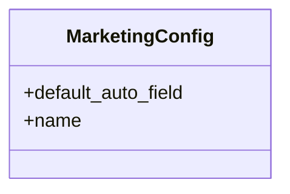

# services_modules.marketing.apps

## Imports
- django.apps

## Classes
- MarketingConfig
  - attr: `default_auto_field`
  - attr: `name`

## Class Diagram

```mermaid
classDiagram
    class MarketingConfig {
        +default_auto_field
        +name
    }
```
