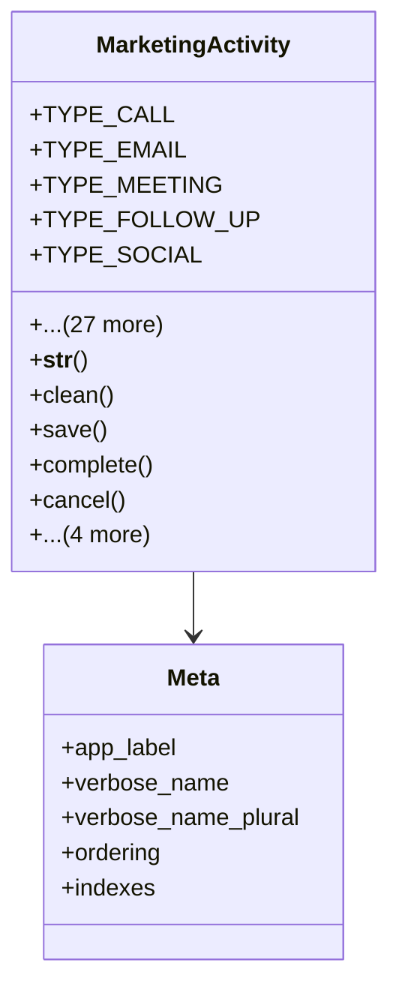

# services_modules.marketing.models.marketing_activity

## Imports
- core_modules.core.models.base_models
- django.core.exceptions
- django.db
- django.utils
- django.utils.translation
- marketing_campaign
- marketing_lead

## Classes
- MarketingActivity
  - attr: `TYPE_CALL`
  - attr: `TYPE_EMAIL`
  - attr: `TYPE_MEETING`
  - attr: `TYPE_FOLLOW_UP`
  - attr: `TYPE_SOCIAL`
  - attr: `TYPE_SMS`
  - attr: `TYPE_OTHER`
  - attr: `TYPE_CHOICES`
  - attr: `STATUS_PLANNED`
  - attr: `STATUS_IN_PROGRESS`
  - attr: `STATUS_COMPLETED`
  - attr: `STATUS_CANCELLED`
  - attr: `STATUS_CHOICES`
  - attr: `RESULT_POSITIVE`
  - attr: `RESULT_NEUTRAL`
  - attr: `RESULT_NEGATIVE`
  - attr: `RESULT_NONE`
  - attr: `RESULT_CHOICES`
  - attr: `name`
  - attr: `description`
  - attr: `activity_type`
  - attr: `status`
  - attr: `result`
  - attr: `campaign`
  - attr: `lead`
  - attr: `scheduled_date`
  - attr: `scheduled_time`
  - attr: `duration`
  - attr: `completion_date`
  - attr: `completion_time`
  - attr: `notes`
  - attr: `is_active`
  - method: `__str__`
  - method: `clean`
  - method: `save`
  - method: `complete`
  - method: `cancel`
  - method: `reschedule`
  - method: `start`
  - method: `is_overdue`
  - method: `get_duration_str`
- Meta
  - attr: `app_label`
  - attr: `verbose_name`
  - attr: `verbose_name_plural`
  - attr: `ordering`
  - attr: `indexes`

## Functions
- __str__
- clean
- save
- complete
- cancel
- reschedule
- start
- is_overdue
- get_duration_str

## Class Diagram

