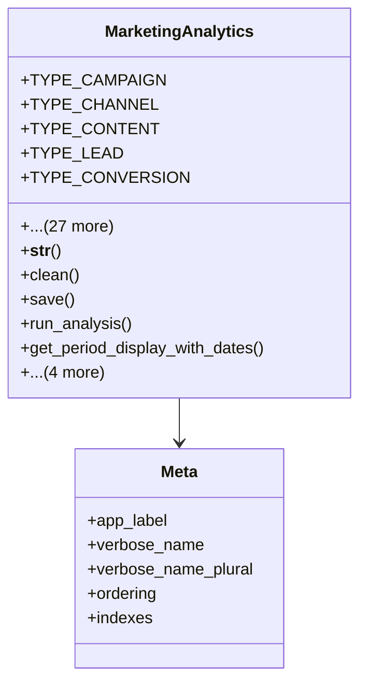

# services_modules.marketing.models.marketing_analytics

## Imports
- core_modules.core.models.base_models
- django.core.exceptions
- django.db
- django.utils
- django.utils.translation
- marketing_campaign
- marketing_channel

## Classes
- MarketingAnalytics
  - attr: `TYPE_CAMPAIGN`
  - attr: `TYPE_CHANNEL`
  - attr: `TYPE_CONTENT`
  - attr: `TYPE_LEAD`
  - attr: `TYPE_CONVERSION`
  - attr: `TYPE_ENGAGEMENT`
  - attr: `TYPE_ROI`
  - attr: `TYPE_CUSTOM`
  - attr: `TYPE_CHOICES`
  - attr: `PERIOD_DAILY`
  - attr: `PERIOD_WEEKLY`
  - attr: `PERIOD_MONTHLY`
  - attr: `PERIOD_QUARTERLY`
  - attr: `PERIOD_YEARLY`
  - attr: `PERIOD_CUSTOM`
  - attr: `PERIOD_CHOICES`
  - attr: `name`
  - attr: `analytics_type`
  - attr: `description`
  - attr: `campaign`
  - attr: `channel`
  - attr: `period`
  - attr: `start_date`
  - attr: `end_date`
  - attr: `metrics`
  - attr: `kpis`
  - attr: `insights`
  - attr: `recommendations`
  - attr: `is_automated`
  - attr: `schedule`
  - attr: `last_run`
  - attr: `is_active`
  - method: `__str__`
  - method: `clean`
  - method: `save`
  - method: `run_analysis`
  - method: `get_period_display_with_dates`
  - method: `get_key_metrics`
  - method: `get_kpi_status`
  - method: `schedule_analysis`
  - method: `cancel_schedule`
- Meta
  - attr: `app_label`
  - attr: `verbose_name`
  - attr: `verbose_name_plural`
  - attr: `ordering`
  - attr: `indexes`

## Functions
- __str__
- clean
- save
- run_analysis
- get_period_display_with_dates
- get_key_metrics
- get_kpi_status
- schedule_analysis
- cancel_schedule

## Class Diagram

