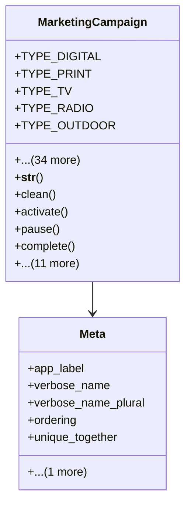

# services_modules.marketing.models.marketing_campaign

## Imports
- core_modules.core.models.company
- core_modules.core.models.currency
- datetime
- decimal
- django.core.exceptions
- django.db
- django.utils
- django.utils.translation

## Classes
- MarketingCampaign
  - attr: `TYPE_DIGITAL`
  - attr: `TYPE_PRINT`
  - attr: `TYPE_TV`
  - attr: `TYPE_RADIO`
  - attr: `TYPE_OUTDOOR`
  - attr: `TYPE_EVENT`
  - attr: `TYPE_EMAIL`
  - attr: `TYPE_SMS`
  - attr: `TYPE_SOCIAL_MEDIA`
  - attr: `TYPE_INFLUENCER`
  - attr: `TYPE_OTHER`
  - attr: `CAMPAIGN_TYPE_CHOICES`
  - attr: `STATUS_DRAFT`
  - attr: `STATUS_PLANNED`
  - attr: `STATUS_ACTIVE`
  - attr: `STATUS_PAUSED`
  - attr: `STATUS_COMPLETED`
  - attr: `STATUS_CANCELLED`
  - attr: `CAMPAIGN_STATUS_CHOICES`
  - attr: `name`
  - attr: `code`
  - attr: `campaign_type`
  - attr: `description`
  - attr: `company`
  - attr: `start_date`
  - attr: `end_date`
  - attr: `planned_budget`
  - attr: `actual_cost`
  - attr: `currency`
  - attr: `target_audience`
  - attr: `target_leads`
  - attr: `actual_leads`
  - attr: `target_conversions`
  - attr: `actual_conversions`
  - attr: `actual_revenue`
  - attr: `status`
  - attr: `is_active`
  - attr: `notes`
  - attr: `tags`
  - method: `__str__`
  - method: `clean`
  - method: `activate`
  - method: `pause`
  - method: `complete`
  - method: `cancel`
  - method: `get_roi`
  - method: `is_active_campaign`
  - method: `get_duration_days`
  - method: `get_days_remaining`
  - method: `get_progress_percentage`
  - method: `get_budget_utilization`
  - method: `get_conversion_rate`
  - method: `get_cost_per_lead`
  - method: `get_cost_per_acquisition`
  - method: `get_performance_metrics`
- Meta
  - attr: `app_label`
  - attr: `verbose_name`
  - attr: `verbose_name_plural`
  - attr: `ordering`
  - attr: `unique_together`
  - attr: `indexes`

## Functions
- __str__
- clean
- activate
- pause
- complete
- cancel
- get_roi
- is_active_campaign
- get_duration_days
- get_days_remaining
- get_progress_percentage
- get_budget_utilization
- get_conversion_rate
- get_cost_per_lead
- get_cost_per_acquisition
- get_performance_metrics

## Class Diagram

