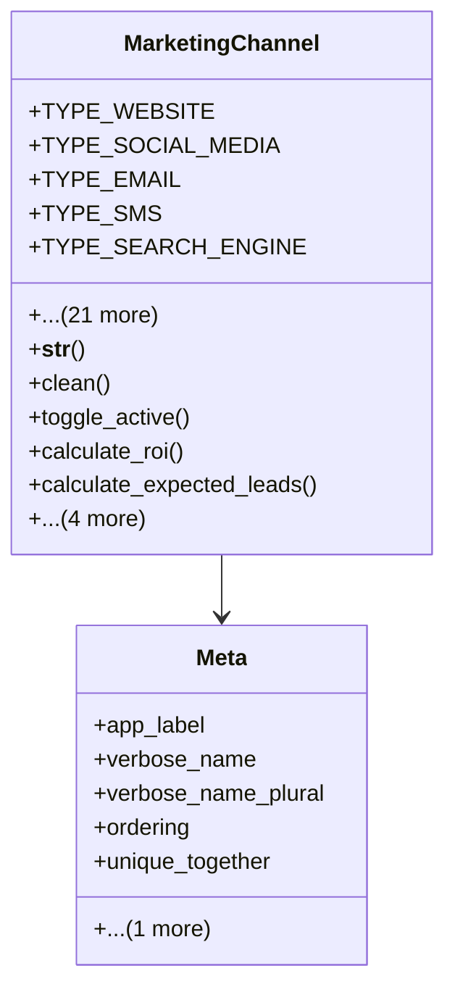

# services_modules.marketing.models.marketing_channel

## Imports
- core_modules.core.models.company
- decimal
- django.core.exceptions
- django.db
- django.utils.translation
- marketing_campaign

## Classes
- MarketingChannel
  - attr: `TYPE_WEBSITE`
  - attr: `TYPE_SOCIAL_MEDIA`
  - attr: `TYPE_EMAIL`
  - attr: `TYPE_SMS`
  - attr: `TYPE_SEARCH_ENGINE`
  - attr: `TYPE_DISPLAY_ADS`
  - attr: `TYPE_AFFILIATE`
  - attr: `TYPE_DIRECT_MAIL`
  - attr: `TYPE_TELEMARKETING`
  - attr: `TYPE_EVENT`
  - attr: `TYPE_OTHER`
  - attr: `CHANNEL_TYPE_CHOICES`
  - attr: `name`
  - attr: `code`
  - attr: `channel_type`
  - attr: `description`
  - attr: `company`
  - attr: `platform`
  - attr: `url`
  - attr: `cost_per_lead`
  - attr: `cost_per_acquisition`
  - attr: `conversion_rate`
  - attr: `is_active`
  - attr: `campaigns`
  - attr: `notes`
  - attr: `tags`
  - method: `__str__`
  - method: `clean`
  - method: `toggle_active`
  - method: `calculate_roi`
  - method: `calculate_expected_leads`
  - method: `calculate_expected_acquisitions`
  - method: `calculate_expected_revenue`
  - method: `get_active_campaigns`
  - method: `get_performance_metrics`
- Meta
  - attr: `app_label`
  - attr: `verbose_name`
  - attr: `verbose_name_plural`
  - attr: `ordering`
  - attr: `unique_together`
  - attr: `indexes`

## Functions
- __str__
- clean
- toggle_active
- calculate_roi
- calculate_expected_leads
- calculate_expected_acquisitions
- calculate_expected_revenue
- get_active_campaigns
- get_performance_metrics

## Class Diagram

