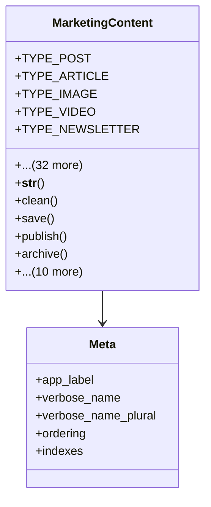

# services_modules.marketing.models.marketing_content

## Imports
- core_modules.core.models.base_models
- django.core.exceptions
- django.db
- django.utils
- django.utils.translation
- marketing_campaign
- marketing_channel

## Classes
- MarketingContent
  - attr: `TYPE_POST`
  - attr: `TYPE_ARTICLE`
  - attr: `TYPE_IMAGE`
  - attr: `TYPE_VIDEO`
  - attr: `TYPE_NEWSLETTER`
  - attr: `TYPE_INFOGRAPHIC`
  - attr: `TYPE_EBOOK`
  - attr: `TYPE_WEBINAR`
  - attr: `TYPE_OTHER`
  - attr: `TYPE_CHOICES`
  - attr: `STATUS_DRAFT`
  - attr: `STATUS_REVIEW`
  - attr: `STATUS_APPROVED`
  - attr: `STATUS_PUBLISHED`
  - attr: `STATUS_ARCHIVED`
  - attr: `STATUS_CHOICES`
  - attr: `title`
  - attr: `content_type`
  - attr: `description`
  - attr: `content`
  - attr: `campaign`
  - attr: `channel`
  - attr: `status`
  - attr: `publish_date`
  - attr: `expiry_date`
  - attr: `keywords`
  - attr: `target_audience`
  - attr: `file_url`
  - attr: `thumbnail_url`
  - attr: `external_url`
  - attr: `is_featured`
  - attr: `is_active`
  - attr: `view_count`
  - attr: `like_count`
  - attr: `share_count`
  - attr: `comment_count`
  - attr: `notes`
  - method: `__str__`
  - method: `clean`
  - method: `save`
  - method: `publish`
  - method: `archive`
  - method: `approve`
  - method: `submit_for_review`
  - method: `increment_view_count`
  - method: `increment_like_count`
  - method: `increment_share_count`
  - method: `increment_comment_count`
  - method: `get_engagement_metrics`
  - method: `calculate_engagement_rate`
  - method: `get_keywords_list`
  - method: `is_published`
- Meta
  - attr: `app_label`
  - attr: `verbose_name`
  - attr: `verbose_name_plural`
  - attr: `ordering`
  - attr: `indexes`

## Functions
- __str__
- clean
- save
- publish
- archive
- approve
- submit_for_review
- increment_view_count
- increment_like_count
- increment_share_count
- increment_comment_count
- get_engagement_metrics
- calculate_engagement_rate
- get_keywords_list
- is_published

## Class Diagram

