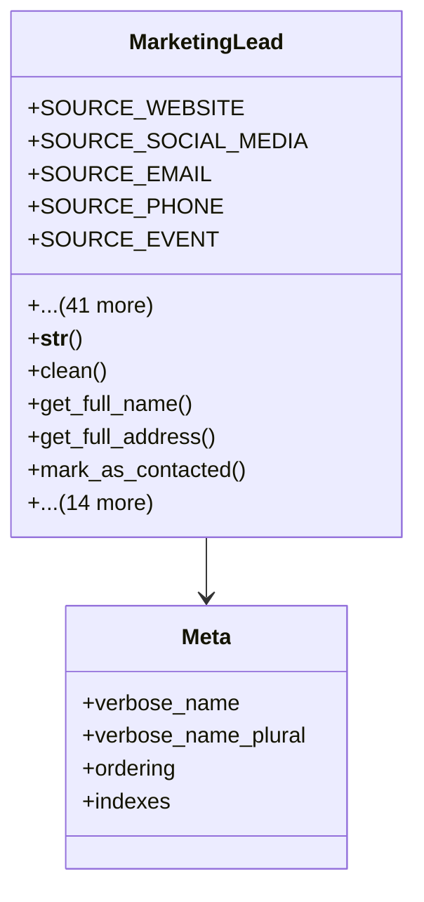

# services_modules.marketing.models.marketing_lead

## Imports
- core_modules.companies.models
- decimal
- django.core.exceptions
- django.db
- django.utils
- django.utils.translation
- services_modules.marketing.models.marketing_campaign
- services_modules.marketing.models.marketing_channel
- services_modules.marketing.models.marketing_segment

## Classes
- MarketingLead
  - attr: `SOURCE_WEBSITE`
  - attr: `SOURCE_SOCIAL_MEDIA`
  - attr: `SOURCE_EMAIL`
  - attr: `SOURCE_PHONE`
  - attr: `SOURCE_EVENT`
  - attr: `SOURCE_REFERRAL`
  - attr: `SOURCE_ADVERTISEMENT`
  - attr: `SOURCE_OTHER`
  - attr: `LEAD_SOURCE_CHOICES`
  - attr: `STATUS_NEW`
  - attr: `STATUS_CONTACTED`
  - attr: `STATUS_QUALIFIED`
  - attr: `STATUS_UNQUALIFIED`
  - attr: `STATUS_CONVERTED`
  - attr: `STATUS_LOST`
  - attr: `LEAD_STATUS_CHOICES`
  - attr: `PRIORITY_LOW`
  - attr: `PRIORITY_MEDIUM`
  - attr: `PRIORITY_HIGH`
  - attr: `LEAD_PRIORITY_CHOICES`
  - attr: `first_name`
  - attr: `last_name`
  - attr: `email`
  - attr: `phone`
  - attr: `company_name`
  - attr: `job_title`
  - attr: `address`
  - attr: `city`
  - attr: `state`
  - attr: `country`
  - attr: `postal_code`
  - attr: `source`
  - attr: `status`
  - attr: `priority`
  - attr: `acquisition_date`
  - attr: `last_contact_date`
  - attr: `next_contact_date`
  - attr: `conversion_date`
  - attr: `estimated_value`
  - attr: `acquisition_cost`
  - attr: `company`
  - attr: `campaign`
  - attr: `channel`
  - attr: `segment`
  - attr: `notes`
  - attr: `tags`
  - method: `__str__`
  - method: `clean`
  - method: `get_full_name`
  - method: `get_full_address`
  - method: `mark_as_contacted`
  - method: `mark_as_qualified`
  - method: `mark_as_unqualified`
  - method: `mark_as_converted`
  - method: `mark_as_lost`
  - method: `update_priority`
  - method: `schedule_next_contact`
  - method: `record_contact`
  - method: `calculate_days_since_acquisition`
  - method: `calculate_days_since_last_contact`
  - method: `calculate_days_until_next_contact`
  - method: `is_overdue_for_contact`
  - method: `get_status_display_value`
  - method: `get_source_display_value`
  - method: `get_priority_display_value`
- Meta
  - attr: `verbose_name`
  - attr: `verbose_name_plural`
  - attr: `ordering`
  - attr: `indexes`

## Functions
- __str__
- clean
- get_full_name
- get_full_address
- mark_as_contacted
- mark_as_qualified
- mark_as_unqualified
- mark_as_converted
- mark_as_lost
- update_priority
- schedule_next_contact
- record_contact
- calculate_days_since_acquisition
- calculate_days_since_last_contact
- calculate_days_until_next_contact
- is_overdue_for_contact
- get_status_display_value
- get_source_display_value
- get_priority_display_value

## Class Diagram

