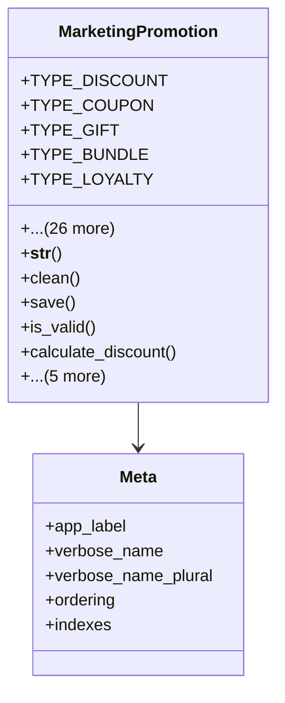

# services_modules.marketing.models.marketing_promotion

## Imports
- core_modules.core.models.base_models
- django.core.exceptions
- django.db
- django.utils
- django.utils.translation
- marketing_campaign

## Classes
- MarketingPromotion
  - attr: `TYPE_DISCOUNT`
  - attr: `TYPE_COUPON`
  - attr: `TYPE_GIFT`
  - attr: `TYPE_BUNDLE`
  - attr: `TYPE_LOYALTY`
  - attr: `TYPE_REFERRAL`
  - attr: `TYPE_OTHER`
  - attr: `TYPE_CHOICES`
  - attr: `STATUS_DRAFT`
  - attr: `STATUS_PLANNED`
  - attr: `STATUS_ACTIVE`
  - attr: `STATUS_EXPIRED`
  - attr: `STATUS_CANCELLED`
  - attr: `STATUS_CHOICES`
  - attr: `name`
  - attr: `code`
  - attr: `promotion_type`
  - attr: `description`
  - attr: `campaign`
  - attr: `start_date`
  - attr: `end_date`
  - attr: `discount_value`
  - attr: `discount_type`
  - attr: `minimum_order_value`
  - attr: `maximum_discount`
  - attr: `usage_limit`
  - attr: `usage_count`
  - attr: `is_public`
  - attr: `status`
  - attr: `is_active`
  - attr: `terms_and_conditions`
  - method: `__str__`
  - method: `clean`
  - method: `save`
  - method: `is_valid`
  - method: `calculate_discount`
  - method: `use_promotion`
  - method: `activate`
  - method: `deactivate`
  - method: `get_remaining_uses`
  - method: `get_days_remaining`
- Meta
  - attr: `app_label`
  - attr: `verbose_name`
  - attr: `verbose_name_plural`
  - attr: `ordering`
  - attr: `indexes`

## Functions
- __str__
- clean
- save
- is_valid
- calculate_discount
- use_promotion
- activate
- deactivate
- get_remaining_uses
- get_days_remaining

## Class Diagram

