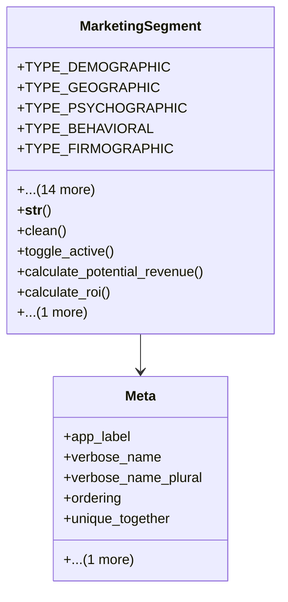

# services_modules.marketing.models.marketing_segment

## Imports
- core_modules.companies.models
- decimal
- django.core.exceptions
- django.db
- django.utils.translation

## Classes
- MarketingSegment
  - attr: `TYPE_DEMOGRAPHIC`
  - attr: `TYPE_GEOGRAPHIC`
  - attr: `TYPE_PSYCHOGRAPHIC`
  - attr: `TYPE_BEHAVIORAL`
  - attr: `TYPE_FIRMOGRAPHIC`
  - attr: `TYPE_CUSTOM`
  - attr: `SEGMENT_TYPE_CHOICES`
  - attr: `name`
  - attr: `code`
  - attr: `segment_type`
  - attr: `description`
  - attr: `company`
  - attr: `criteria`
  - attr: `estimated_size`
  - attr: `potential_value`
  - attr: `conversion_rate`
  - attr: `is_active`
  - attr: `notes`
  - attr: `tags`
  - method: `__str__`
  - method: `clean`
  - method: `toggle_active`
  - method: `calculate_potential_revenue`
  - method: `calculate_roi`
  - method: `get_performance_metrics`
- Meta
  - attr: `app_label`
  - attr: `verbose_name`
  - attr: `verbose_name_plural`
  - attr: `ordering`
  - attr: `unique_together`
  - attr: `indexes`

## Functions
- __str__
- clean
- toggle_active
- calculate_potential_revenue
- calculate_roi
- get_performance_metrics

## Class Diagram

