# services_modules.marketing.tests.test_marketing

## Imports
- core_modules.core.models
- datetime
- decimal
- django.contrib.auth
- django.core.exceptions
- django.db
- django.test
- django.utils
- models.marketing_campaign
- models.marketing_channel
- models.marketing_lead

## Classes
- CampaignTypeModelTest
  - method: `setUp`
  - method: `test_create_campaign_type`
  - method: `test_unique_code_per_company`
  - method: `test_deactivate_campaign_type`
- CampaignStatusModelTest
  - method: `setUp`
  - method: `test_create_campaign_status`
  - method: `test_unique_code_per_company`
- CampaignModelTest
  - method: `setUp`
  - method: `test_create_campaign`
  - method: `test_unique_code_per_company`
  - method: `test_calculate_campaign_duration`
  - method: `test_is_active`
- LeadSourceModelTest
  - method: `setUp`
  - method: `test_create_lead_source`
  - method: `test_unique_code_per_company`
- LeadStatusModelTest
  - method: `setUp`
  - method: `test_create_lead_status`
  - method: `test_unique_code_per_company`
- LeadModelTest
  - method: `setUp`
  - method: `test_create_lead`
  - method: `test_lead_conversion`
  - method: `test_calculate_lead_age`
- MarketingChannelModelTest
  - method: `setUp`
  - method: `test_create_marketing_channel`
  - method: `test_unique_code_per_company`
- SocialMediaAccountModelTest
  - method: `setUp`
  - method: `test_create_social_media_account`
  - method: `test_unique_username_per_platform_and_company`
- SocialMediaPostModelTest
  - method: `setUp`
  - method: `test_create_social_media_post`
  - method: `test_is_published`
  - method: `test_update_metrics`

## Functions
- setUp
- test_create_campaign_type
- test_unique_code_per_company
- test_deactivate_campaign_type
- setUp
- test_create_campaign_status
- test_unique_code_per_company
- setUp
- test_create_campaign
- test_unique_code_per_company
- test_calculate_campaign_duration
- test_is_active
- setUp
- test_create_lead_source
- test_unique_code_per_company
- setUp
- test_create_lead_status
- test_unique_code_per_company
- setUp
- test_create_lead
- test_lead_conversion
- test_calculate_lead_age
- setUp
- test_create_marketing_channel
- test_unique_code_per_company
- setUp
- test_create_social_media_account
- test_unique_username_per_platform_and_company
- setUp
- test_create_social_media_post
- test_is_published
- test_update_metrics
- mock_calculate_duration
- mock_is_active
- mock_convert_to_customer
- mock_calculate_age
- mock_is_published
- mock_update_metrics

## Module Variables
- `User`

## Class Diagram

```mermaid
classDiagram
    class CampaignTypeModelTest {
        +setUp()
        +test_create_campaign_type()
        +test_unique_code_per_company()
        +test_deactivate_campaign_type()
    }
    class CampaignStatusModelTest {
        +setUp()
        +test_create_campaign_status()
        +test_unique_code_per_company()
    }
    class CampaignModelTest {
        +setUp()
        +test_create_campaign()
        +test_unique_code_per_company()
        +test_calculate_campaign_duration()
        +test_is_active()
    }
    class LeadSourceModelTest {
        +setUp()
        +test_create_lead_source()
        +test_unique_code_per_company()
    }
    class LeadStatusModelTest {
        +setUp()
        +test_create_lead_status()
        +test_unique_code_per_company()
    }
    class LeadModelTest {
        +setUp()
        +test_create_lead()
        +test_lead_conversion()
        +test_calculate_lead_age()
    }
    class MarketingChannelModelTest {
        +setUp()
        +test_create_marketing_channel()
        +test_unique_code_per_company()
    }
    class SocialMediaAccountModelTest {
        +setUp()
        +test_create_social_media_account()
        +test_unique_username_per_platform_and_company()
    }
    class SocialMediaPostModelTest {
        +setUp()
        +test_create_social_media_post()
        +test_is_published()
        +test_update_metrics()
    }
```

