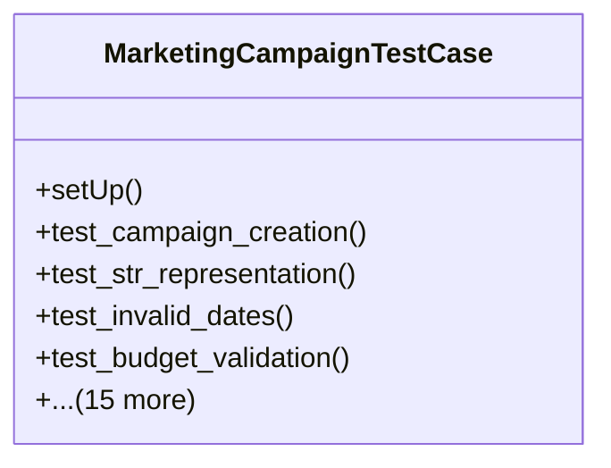

# services_modules.marketing.tests.test_marketing_campaign

## Imports
- core_modules.core.models.company
- core_modules.organization.models
- datetime
- decimal
- django.core.exceptions
- django.db
- django.test
- django.utils
- services_modules.marketing.models.marketing_campaign
- unittest

## Classes
- MarketingCampaignTestCase
  - method: `setUp`
  - method: `test_campaign_creation`
  - method: `test_str_representation`
  - method: `test_invalid_dates`
  - method: `test_budget_validation`
  - method: `test_activate_campaign`
  - method: `test_complete_campaign`
  - method: `test_cancel_campaign`
  - method: `test_calculate_roi`
  - method: `test_calculate_roi_with_zero_cost`
  - method: `test_is_active_campaign`
  - method: `test_is_not_active_campaign_due_to_status`
  - method: `test_is_not_active_campaign_due_to_dates`
  - method: `test_is_not_active_campaign_due_to_is_active_flag`
  - method: `test_get_duration_days`
  - method: `test_get_days_remaining`
  - method: `test_get_days_remaining_for_past_campaign`
  - method: `test_get_progress_percentage`
  - method: `test_get_progress_percentage_for_future_campaign`
  - method: `test_get_progress_percentage_for_completed_campaign`

## Functions
- setUp
- test_campaign_creation
- test_str_representation
- test_invalid_dates
- test_budget_validation
- test_activate_campaign
- test_complete_campaign
- test_cancel_campaign
- test_calculate_roi
- test_calculate_roi_with_zero_cost
- test_is_active_campaign
- test_is_not_active_campaign_due_to_status
- test_is_not_active_campaign_due_to_dates
- test_is_not_active_campaign_due_to_is_active_flag
- test_get_duration_days
- test_get_days_remaining
- test_get_days_remaining_for_past_campaign
- test_get_progress_percentage
- test_get_progress_percentage_for_future_campaign
- test_get_progress_percentage_for_completed_campaign

## Class Diagram

