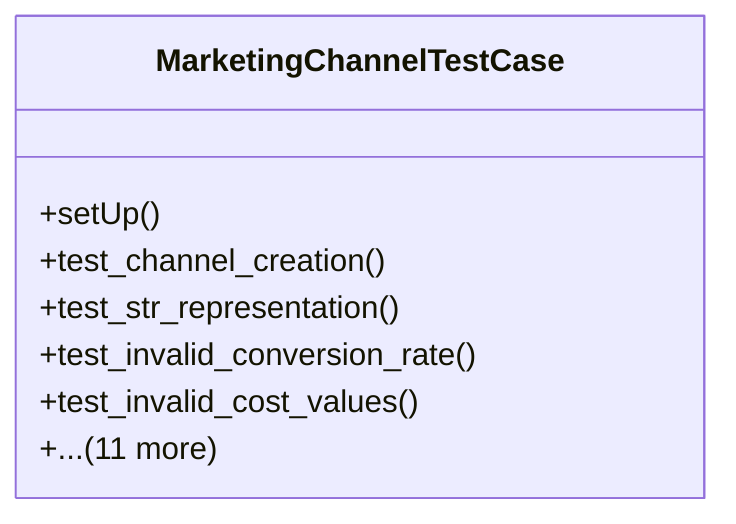

# services_modules.marketing.tests.test_marketing_channel

## Imports
- core_modules.core.models.company
- datetime
- decimal
- django.core.exceptions
- django.db
- django.test
- django.utils
- services_modules.marketing.models.marketing_channel
- unittest

## Classes
- MarketingChannelTestCase
  - method: `setUp`
  - method: `test_channel_creation`
  - method: `test_str_representation`
  - method: `test_invalid_conversion_rate`
  - method: `test_invalid_cost_values`
  - method: `test_toggle_active`
  - method: `test_calculate_roi`
  - method: `test_calculate_roi_with_zero_cost`
  - method: `test_calculate_roi_with_negative_revenue`
  - method: `test_calculate_expected_leads`
  - method: `test_calculate_expected_leads_with_zero_cost_per_lead`
  - method: `test_calculate_expected_acquisitions`
  - method: `test_calculate_expected_acquisitions_with_zero_conversion_rate`
  - method: `test_calculate_expected_revenue`
  - method: `test_calculate_expected_revenue_with_zero_acquisitions`
  - method: `test_get_performance_metrics`

## Functions
- setUp
- test_channel_creation
- test_str_representation
- test_invalid_conversion_rate
- test_invalid_cost_values
- test_toggle_active
- test_calculate_roi
- test_calculate_roi_with_zero_cost
- test_calculate_roi_with_negative_revenue
- test_calculate_expected_leads
- test_calculate_expected_leads_with_zero_cost_per_lead
- test_calculate_expected_acquisitions
- test_calculate_expected_acquisitions_with_zero_conversion_rate
- test_calculate_expected_revenue
- test_calculate_expected_revenue_with_zero_acquisitions
- test_get_performance_metrics

## Class Diagram

