# services_modules.projects.admin

## Imports
- django.contrib
- django.contrib.contenttypes.admin
- django.contrib.contenttypes.models
- django.utils.translation
- models.dependencies
- models.financials
- models.project
- models.project_gantt
- models.project_member
- models.project_phase

## Classes
- ProjectMemberInline
  - attr: `model`
  - attr: `extra`
  - attr: `raw_id_fields`
  - attr: `fields`
  - attr: `verbose_name`
  - attr: `verbose_name_plural`
  - attr: `list_per_page`
- ProjectPhaseInline
  - attr: `model`
  - attr: `extra`
  - attr: `fields`
  - attr: `ordering`
  - attr: `verbose_name`
  - attr: `verbose_name_plural`
  - attr: `list_per_page`
- ProjectTaskInline
  - attr: `model`
  - attr: `extra`
  - attr: `fields`
  - attr: `readonly_fields`
  - attr: `raw_id_fields`
  - attr: `ordering`
  - attr: `verbose_name`
  - attr: `verbose_name_plural`
  - attr: `list_per_page`
- ProjectDocumentInline
  - attr: `model`
  - attr: `extra`
  - attr: `fields`
  - attr: `readonly_fields`
  - attr: `raw_id_fields`
  - attr: `verbose_name`
  - attr: `verbose_name_plural`
  - attr: `list_per_page`
  - method: `formfield_for_foreignkey`
- ProjectRiskInline
  - attr: `model`
  - attr: `extra`
  - attr: `fields`
  - attr: `readonly_fields`
  - attr: `raw_id_fields`
  - attr: `verbose_name`
  - attr: `verbose_name_plural`
  - attr: `list_per_page`
- ProjectFinancialTransactionInline
  - attr: `model`
  - attr: `extra`
  - attr: `fields`
  - attr: `readonly_fields`
  - attr: `raw_id_fields`
  - attr: `verbose_name`
  - attr: `verbose_name_plural`
  - attr: `ct_field`
  - attr: `ct_fk_field`
  - attr: `list_per_page`
  - method: `formfield_for_foreignkey`
- ProjectAdmin
  - attr: `list_display`
  - attr: `list_filter`
  - attr: `search_fields`
  - attr: `date_hierarchy`
  - attr: `readonly_fields`
  - attr: `raw_id_fields`
  - attr: `fieldsets`
  - attr: `inlines`
  - attr: `list_per_page`
- ProjectPhaseAdmin
  - attr: `list_display`
  - attr: `list_filter`
  - attr: `search_fields`
  - attr: `autocomplete_fields`
  - attr: `ordering`
  - attr: `list_per_page`
- ProjectTaskAdmin
  - attr: `list_display`
  - attr: `list_filter`
  - attr: `search_fields`
  - attr: `date_hierarchy`
  - attr: `readonly_fields`
  - attr: `raw_id_fields`
  - attr: `fieldsets`
  - attr: `list_per_page`
  - method: `save_model`
- ProjectTaskDependencyAdmin
  - attr: `list_display`
  - attr: `list_filter`
  - attr: `search_fields`
  - attr: `raw_id_fields`
  - attr: `list_per_page`
  - method: `get_task_title`
  - method: `get_dependency_title`
- TaskDependencyAdmin
  - attr: `list_display`
  - attr: `list_filter`
  - attr: `search_fields`
  - attr: `autocomplete_fields`
  - attr: `date_hierarchy`
  - attr: `list_per_page`
- ProjectDocumentAdmin
  - attr: `list_display`
  - attr: `list_filter`
  - attr: `search_fields`
  - attr: `date_hierarchy`
  - attr: `readonly_fields`
  - attr: `raw_id_fields`
  - attr: `list_per_page`
  - method: `save_model`
- ProjectRiskAdmin
  - attr: `list_display`
  - attr: `list_filter`
  - attr: `search_fields`
  - attr: `date_hierarchy`
  - attr: `readonly_fields`
  - attr: `raw_id_fields`
  - attr: `fieldsets`
  - attr: `list_per_page`
- GanttSettingsAdmin
  - attr: `list_display`
  - attr: `list_filter`
  - attr: `search_fields`
  - attr: `raw_id_fields`
  - attr: `list_per_page`
- GanttSnapshotAdmin
  - attr: `list_display`
  - attr: `list_filter`
  - attr: `search_fields`
  - attr: `readonly_fields`
  - attr: `raw_id_fields`
  - attr: `list_per_page`
- ProjectFinancialTransactionAdmin
  - attr: `list_display`
  - attr: `list_filter`
  - attr: `search_fields`
  - attr: `readonly_fields`
  - attr: `raw_id_fields`
  - attr: `date_hierarchy`
  - attr: `list_per_page`
  - method: `source_document_display`

## Functions
- formfield_for_foreignkey
- formfield_for_foreignkey
- save_model
- get_task_title
- get_dependency_title
- save_model
- source_document_display

## Class Diagram

```mermaid
classDiagram
    class ProjectMemberInline {
        +model
        +extra
        +raw_id_fields
        +fields
        +verbose_name
        +... (2 more)
    }
    class ProjectPhaseInline {
        +model
        +extra
        +fields
        +ordering
        +verbose_name
        +... (2 more)
    }
    class ProjectTaskInline {
        +model
        +extra
        +fields
        +readonly_fields
        +raw_id_fields
        +... (4 more)
    }
    class ProjectDocumentInline {
        +model
        +extra
        +fields
        +readonly_fields
        +raw_id_fields
        +... (3 more)
        +formfield_for_foreignkey()
    }
    class ProjectRiskInline {
        +model
        +extra
        +fields
        +readonly_fields
        +raw_id_fields
        +... (3 more)
    }
    class ProjectFinancialTransactionInline {
        +model
        +extra
        +fields
        +readonly_fields
        +raw_id_fields
        +... (5 more)
        +formfield_for_foreignkey()
    }
    class ProjectAdmin {
        +list_display
        +list_filter
        +search_fields
        +date_hierarchy
        +readonly_fields
        +... (4 more)
    }
    class ProjectPhaseAdmin {
        +list_display
        +list_filter
        +search_fields
        +autocomplete_fields
        +ordering
        +... (1 more)
    }
    class ProjectTaskAdmin {
        +list_display
        +list_filter
        +search_fields
        +date_hierarchy
        +readonly_fields
        +... (3 more)
        +save_model()
    }
    class ProjectTaskDependencyAdmin {
        +list_display
        +list_filter
        +search_fields
        +raw_id_fields
        +list_per_page
        +get_task_title()
        +get_dependency_title()
    }
    class TaskDependencyAdmin {
        +list_display
        +list_filter
        +search_fields
        +autocomplete_fields
        +date_hierarchy
        +... (1 more)
    }
    class ProjectDocumentAdmin {
        +list_display
        +list_filter
        +search_fields
        +date_hierarchy
        +readonly_fields
        +... (2 more)
        +save_model()
    }
    class ProjectRiskAdmin {
        +list_display
        +list_filter
        +search_fields
        +date_hierarchy
        +readonly_fields
        +... (3 more)
    }
    class GanttSettingsAdmin {
        +list_display
        +list_filter
        +search_fields
        +raw_id_fields
        +list_per_page
    }
    class GanttSnapshotAdmin {
        +list_display
        +list_filter
        +search_fields
        +readonly_fields
        +raw_id_fields
        +... (1 more)
    }
    class ProjectFinancialTransactionAdmin {
        +list_display
        +list_filter
        +search_fields
        +readonly_fields
        +raw_id_fields
        +... (2 more)
        +source_document_display()
    }
```

