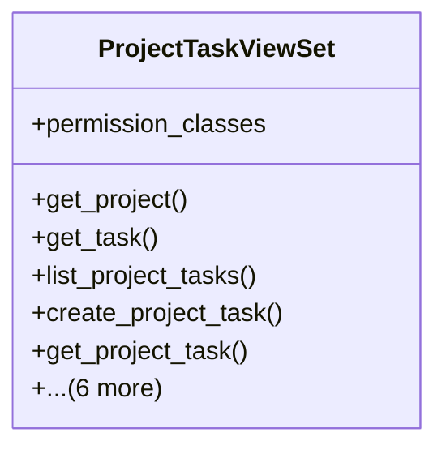

# services_modules.projects.api.project_task_api

## Imports
- django.contrib.auth
- django.core.exceptions
- django.db
- django.shortcuts
- models.project
- models.task
- permissions
- rest_framework
- rest_framework.decorators
- rest_framework.response
- serializers.task_serializer
- services.project_task_integration

## Classes
- ProjectTaskViewSet
  - attr: `permission_classes`
  - method: `get_project`
  - method: `get_task`
  - method: `list_project_tasks`
  - method: `create_project_task`
  - method: `get_project_task`
  - method: `update_project_task`
  - method: `delete_project_task`
  - method: `assign_task`
  - method: `get_project_tasks_statistics`
  - method: `get_project_overdue_tasks`
  - method: `get_project_completion_percentage`

## Functions
- get_project
- get_task
- list_project_tasks
- create_project_task
- get_project_task
- update_project_task
- delete_project_task
- assign_task
- get_project_tasks_statistics
- get_project_overdue_tasks
- get_project_completion_percentage

## Class Diagram

