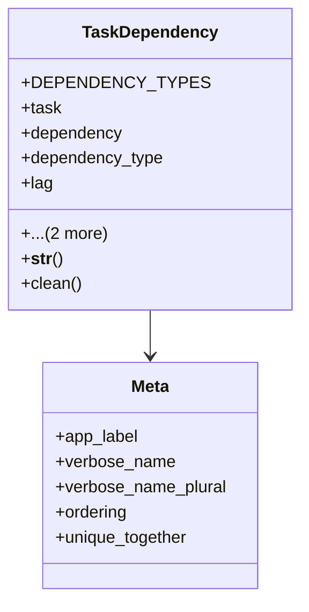

# services_modules.projects.models.dependencies

## Imports
- django.core.exceptions
- django.db
- django.utils.translation
- services_modules.tasks.models.task

## Classes
- TaskDependency
  - attr: `DEPENDENCY_TYPES`
  - attr: `task`
  - attr: `dependency`
  - attr: `dependency_type`
  - attr: `lag`
  - attr: `is_mandatory`
  - attr: `created_at`
  - method: `__str__`
  - method: `clean`
- Meta
  - attr: `app_label`
  - attr: `verbose_name`
  - attr: `verbose_name_plural`
  - attr: `ordering`
  - attr: `unique_together`

## Functions
- __str__
- clean

## Class Diagram

