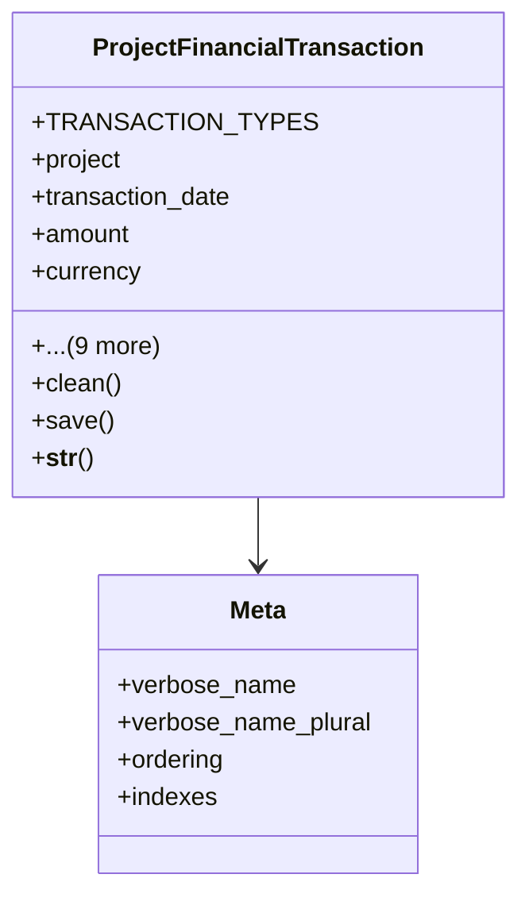

# services_modules.projects.models.financials

## Imports
- decimal
- django.conf
- django.contrib.contenttypes.fields
- django.contrib.contenttypes.models
- django.core.exceptions
- django.core.validators
- django.db
- django.utils.translation

## Classes
- ProjectFinancialTransaction
  - attr: `TRANSACTION_TYPES`
  - attr: `project`
  - attr: `transaction_date`
  - attr: `amount`
  - attr: `currency`
  - attr: `description`
  - attr: `content_type`
  - attr: `object_id`
  - attr: `source_document`
  - attr: `transaction_type`
  - attr: `company`
  - attr: `created_by`
  - attr: `created_at`
  - attr: `updated_at`
  - method: `clean`
  - method: `save`
  - method: `__str__`
- Meta
  - attr: `verbose_name`
  - attr: `verbose_name_plural`
  - attr: `ordering`
  - attr: `indexes`

## Functions
- limit_financial_models
- clean
- save
- __str__

## Class Diagram

