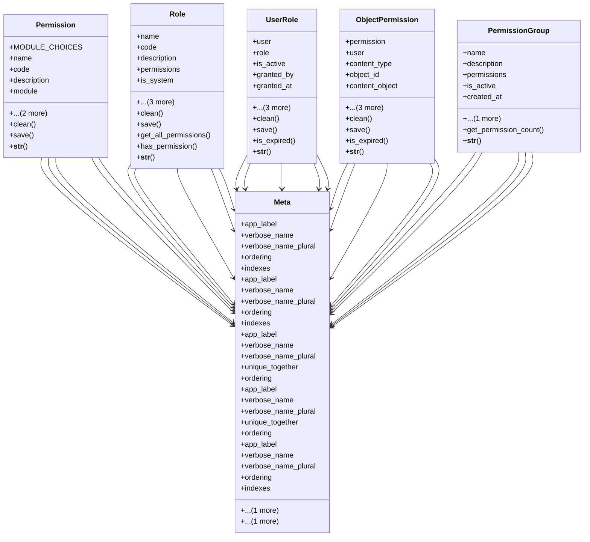

# services_modules.projects.models.permissions

## Imports
- django.contrib.auth
- django.contrib.contenttypes.fields
- django.contrib.contenttypes.models
- django.core.exceptions
- django.db
- django.utils
- django.utils.translation
- json

## Classes
- Permission
  - attr: `MODULE_CHOICES`
  - attr: `name`
  - attr: `code`
  - attr: `description`
  - attr: `module`
  - attr: `created_at`
  - attr: `updated_at`
  - method: `clean`
  - method: `save`
  - method: `__str__`
- Role
  - attr: `name`
  - attr: `code`
  - attr: `description`
  - attr: `permissions`
  - attr: `is_system`
  - attr: `is_active`
  - attr: `created_at`
  - attr: `updated_at`
  - method: `clean`
  - method: `save`
  - method: `get_all_permissions`
  - method: `has_permission`
  - method: `__str__`
- UserRole
  - attr: `user`
  - attr: `role`
  - attr: `is_active`
  - attr: `granted_by`
  - attr: `granted_at`
  - attr: `expires_at`
  - attr: `created_at`
  - attr: `updated_at`
  - method: `clean`
  - method: `save`
  - method: `is_expired`
  - method: `__str__`
- ObjectPermission
  - attr: `permission`
  - attr: `user`
  - attr: `content_type`
  - attr: `object_id`
  - attr: `content_object`
  - attr: `granted_at`
  - attr: `granted_by`
  - attr: `expires_at`
  - method: `clean`
  - method: `save`
  - method: `is_expired`
  - method: `__str__`
- PermissionGroup
  - attr: `name`
  - attr: `description`
  - attr: `permissions`
  - attr: `is_active`
  - attr: `created_at`
  - attr: `updated_at`
  - method: `get_permission_count`
  - method: `__str__`
- Meta
  - attr: `app_label`
  - attr: `verbose_name`
  - attr: `verbose_name_plural`
  - attr: `ordering`
  - attr: `indexes`
- Meta
  - attr: `app_label`
  - attr: `verbose_name`
  - attr: `verbose_name_plural`
  - attr: `ordering`
  - attr: `indexes`
- Meta
  - attr: `app_label`
  - attr: `verbose_name`
  - attr: `verbose_name_plural`
  - attr: `unique_together`
  - attr: `ordering`
  - attr: `indexes`
- Meta
  - attr: `app_label`
  - attr: `verbose_name`
  - attr: `verbose_name_plural`
  - attr: `unique_together`
  - attr: `ordering`
  - attr: `indexes`
- Meta
  - attr: `app_label`
  - attr: `verbose_name`
  - attr: `verbose_name_plural`
  - attr: `ordering`
  - attr: `indexes`

## Functions
- clean
- save
- __str__
- clean
- save
- get_all_permissions
- has_permission
- __str__
- clean
- save
- is_expired
- __str__
- clean
- save
- is_expired
- __str__
- get_permission_count
- __str__

## Module Variables
- `User`
- `DEFAULT_PERMISSIONS`
- `DEFAULT_ROLES`

## Class Diagram

